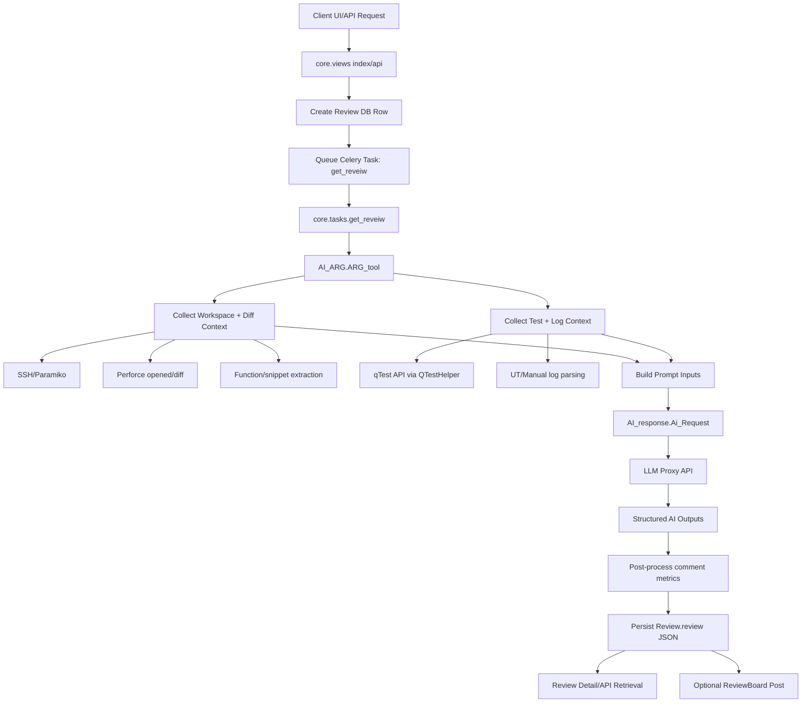
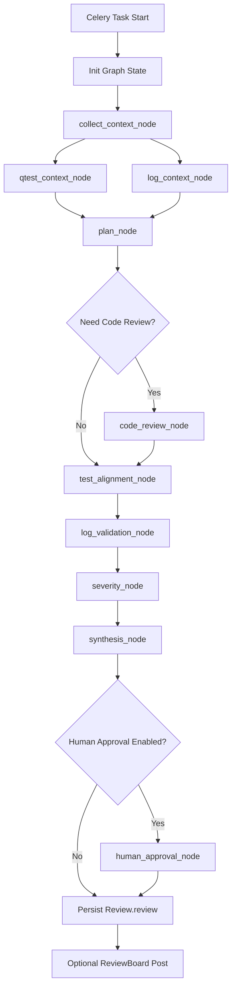

# ARG Project Interview Prep

## Project Explanation

My second project was an AI-powered review automation platform called ARG, Automatic Review Generation.

The purpose of the tool was to automate code review and QA validation for test automation scripts. In many teams, engineers manually compare test scripts, qTest test steps, logs, and coding standards, which is time-consuming and error-prone. We built ARG to reduce manual effort and improve review quality.

The system analyzes automation test scripts, compares the script logic with qTest steps, and generates intelligent review comments automatically.

For example, it detects:

- Missing test steps in the script
- Mismatch between qTest steps and implemented code
- Hardcoded values
- Repetitive code that should be converted into reusable functions
- Invalid docstring formats
- Retry or connection handling issues
- Test coverage gaps
- Raw command usage needing best-practice improvements

On the frontend, I used Next.js to build a fast and responsive dashboard. It included review submission forms, review history, metrics dashboards, and action boards for users and managers.

On the backend, the system processed uploaded workspace paths, logs, and scripts, then ran validation pipelines using LLM APIs for intelligent code analysis and rule-based checks.

I also integrated review board publishing, where generated comments could be pushed directly into the internal review workflow.

The tool supported multiple review modes such as:

- Code only review
- Test steps vs code
- Test steps vs code vs logs

It also tracked metrics like turnaround time, tool usage, and estimated AI cost.

This project helped improve engineering productivity by reducing manual review time and increasing consistency in QA validation.

---

## Challenge Faced and How I Solved It

One major challenge in this project was handling large and inconsistent input data from multiple sources such as test scripts, qTest steps, and execution logs.

Different teams followed different formats, naming conventions, and documentation styles. Because of this, the AI model sometimes produced inaccurate comparisons or missed issues.

My task was to improve reliability and make the review results consistent across projects.

I solved this by introducing a preprocessing layer before sending data to the LLM. I standardized script inputs, normalized qTest steps, cleaned logs, and converted all inputs into a structured format.

I also added rule-based validations before and after the AI analysis. This hybrid approach used deterministic checks for simple rules and LLM reasoning for complex comparisons.

In addition, I improved prompts and added retry/fallback handling for API failures.

As a result, review accuracy improved significantly, false positives were reduced, and users trusted the tool more for daily code reviews.

---

## AI Role in the Project — How I Utilized It

AI was the core intelligence layer in ARG. Without it, the tool would have been a basic linter. With it, the tool became a context-aware reviewer that could reason about logic, intent, and test coverage — something rule-based systems alone cannot do.

### What AI Was Used For

**1. Intelligent Code Review and Comment Generation**
The primary use of AI was to analyze automation test scripts and generate contextual review comments. I sent structured prompts to an LLM API — containing the test script, the corresponding qTest steps, and execution logs — and the model returned review comments highlighting mismatches, missing coverage, and quality issues.

**2. Script-to-Step Comparison**
One of the most complex tasks was comparing what was written in the test script versus what was described in the qTest test steps. This is not a simple string match — it requires understanding intent. I used the LLM to reason about whether the code logically implements the defined test steps, even when naming conventions or variable names differ.

**3. Log Analysis and Failure Root Cause Identification**
When execution logs were included, I prompted the AI to correlate log output with the test script and qTest steps to help identify why a test might be failing — for example, detecting a missing assertion, an unhandled exception, or a retry not being implemented.

**4. Docstring and Code Quality Review**
The model was also used to evaluate docstring quality, flag hardcoded values, identify repetitive logic that should be abstracted into reusable functions, and suggest improvements aligned with the team's coding standards.

---

### How I Engineered the AI Integration

**Prompt Engineering**
I designed structured, context-rich prompts that passed all relevant inputs in a consistent format. The prompt clearly defined the role of the model (act as a senior QA engineer), the task (review this script against these test steps), and the expected output format (structured JSON comments with severity and category).

**Preprocessing Before the LLM Call**
Raw inputs were inconsistent across teams. Before sending data to the model, I normalized qTest step formats, stripped irrelevant log noise, standardized script headers, and unified variable naming patterns. This significantly reduced hallucinations and improved output accuracy.

**Hybrid Approach — Rule-Based + AI**
Not everything needed LLM reasoning. Simple checks like missing docstrings, hardcoded credentials, or incorrect import patterns were handled by deterministic rule-based validators. AI was reserved for complex reasoning tasks. This hybrid approach reduced token usage, lowered cost, and increased speed.

**Post-Processing and Validation**
The AI output was not used directly. I parsed the model's JSON response, validated the structure, filtered out low-confidence comments, and applied business logic to categorize and prioritize the feedback before surfacing it on the dashboard.

**Retry and Fallback Handling**
LLM APIs are not always reliable. I implemented retry logic with exponential backoff and a fallback mechanism that returned rule-based comments when the AI call failed, ensuring the tool always produced some output.

**AI Cost Tracking**  
I tracked token usage per review run — prompt tokens, completion tokens, and estimated cost. This was surfaced in the metrics dashboard so managers could monitor AI usage and control spending.

---

### Impact

- Replaced hours of manual code review with automated, AI-generated feedback in seconds
- Reduced false positives through the hybrid validation approach
- Improved review consistency across teams regardless of coding style differences
- Gave engineers actionable, categorized feedback instead of generic warnings
- Provided managers visibility into AI usage and estimated cost per review

---

## ARG Project — Next.js Based Explanation (Interview Version)

> Use this section when an interviewer asks you to explain the ARG project from a Next.js perspective, or when they ask how the frontend and backend communicated.

---

### How I Would Explain This in an Interview

---

**What the project does:**

ARG is an AI-powered code review platform. The purpose is to automate manual QA review work — engineers would earlier spend hours comparing test scripts, test steps from qTest, and execution logs. ARG replaces that manual effort by using AI to analyze the code and generate structured review comments automatically.

---

**Frontend — Next.js:**

On the frontend, I built the entire user interface using Next.js. It had three main areas.

The first was the **submission form** — where a user would enter the workspace path, select the review mode (such as code-only, or code vs test steps vs logs), and optionally provide a log path or qTest project ID. Once submitted, the form would send a POST request to our backend API.

The second area was the **review detail page** — after submitting, the user would be taken to a result page. Since AI review takes time to process, this page would poll the backend every few seconds to check whether the result was ready. Once the job completed, the page would display the review comments — organized by severity — Major, Minor, and Info — along with a full actions summary.

The third area was the **metrics dashboard** — this showed review history, turnaround time per review, AI token usage, and estimated cost per run. Managers used this to track tool adoption and monitor AI spend.

---

**Backend — How the Request Flows:**

When the user submits a review from the Next.js form, the request goes to a backend API endpoint. The backend does two things immediately — it saves the review record to the database with a status of "pending," and it queues the review job for background processing.

The reason we queue it is because AI review takes 30 seconds to a few minutes depending on the inputs. We cannot make the user wait that long on a synchronous HTTP request. So we hand it off to a background worker and the UI polls for the result.

The background worker picks up the job and runs the core AI orchestration pipeline. This pipeline first reads the workspace and identifies what code changed. Then, based on the review mode selected, it either pulls test steps from qTest, parses execution logs, or both. Once it has all the context, it sends structured prompts to the LLM API in multiple stages — code quality review, test step alignment check, and log correlation check. After all the AI responses come back, it composes a unified actions summary and tags each comment with a severity level. The final structured JSON is saved back to the database and the job is marked complete.

---

**How the UI gets the result:**

Once the background job finishes, the Next.js page — which was polling the status endpoint — gets back the completed result and renders it. The review comments are displayed grouped by severity. The user can then act on the feedback or publish comments directly to the internal review board.

---

**Review Modes:**

The platform supported four modes. Code-only review analyzed just the automation script for quality issues like hardcoded values, missing docstrings, retry handling, and repetitive patterns. Code vs test steps compared the script against qTest steps to check if all steps were implemented correctly. Code vs test steps vs logs added execution log analysis to also detect runtime failures or missing assertions. And test steps vs logs was used for manual test verification without a script.

---

**Why Next.js specifically:**

I chose Next.js because it gave us server-side rendering for fast initial page loads, built-in API routes for lightweight backend endpoints, and easy deployment on our internal infrastructure. The dashboard needed to feel fast and responsive, and Next.js made it straightforward to handle both the UI and API layer in a single unified project.

---

### Key Points to Mention Naturally in an Interview

- The frontend was **Next.js** — submission form, result polling page, metrics dashboard
- The backend used an **async job queue** so AI processing happened in the background, not blocking the user
- The AI pipeline ran in **multiple stages** — code review first, then test step comparison, then log analysis
- Every comment was tagged with a **severity level** — Major, Minor, Info — before being shown on the dashboard
- We tracked **AI cost per review** — token usage was logged and surfaced in the metrics dashboard for managers
- The hybrid approach — **rule-based checks + AI reasoning** — reduced false positives and token usage

---

## AI Interview Questions & Answers — ARG Project

> These are the most likely questions an interviewer will ask about the AI aspects of ARG. Read each answer and practice speaking it naturally.

---

### Q1. Why did you use AI in this project instead of just writing rule-based scripts?

**Answer:**

Rule-based scripts are great for simple, well-defined checks — like "does the docstring exist" or "is there a hardcoded IP address." But the core problem in ARG was much harder than that. We needed to compare what a test *script does* with what the *test step says it should do* — and that comparison requires understanding intent, not just matching text.

For example, a qTest step might say "Verify the device reboots successfully" and the script might have ten lines of SSH commands followed by an assertion. No static rule can reliably say whether those ten lines correctly implement that step. The LLM can reason about that semantically. That is exactly the kind of contextual, intent-aware reasoning that makes AI valuable here.

So we used a hybrid — rule-based checks for the simple stuff, AI for the semantic reasoning that rules cannot do.

---

### Q2. How did you design the prompts for the AI model?

**Answer:**

I followed a structured prompt design. Every prompt had four parts.

First, I defined the **role** — I told the model to act as a senior QA engineer reviewing automation test scripts against defined test steps.

Second, I gave it the **context** — the actual test script code, the qTest steps, and optionally the execution logs. All of this was formatted consistently before being inserted into the prompt.

Third, I defined the **task** clearly — for example, "Compare the script logic against the following test steps and identify any steps that are missing, incorrectly implemented, or have coverage gaps."

Fourth, I specified the **output format** — I asked the model to return a structured JSON with fields like category, severity, line reference, and comment text. This made post-processing predictable and reliable.

The prompt structure stayed consistent across all review operations. Only the task instruction and input data changed depending on the review mode.

---

### Q3. How did you handle cases where the AI returned incorrect or low-quality output?

**Answer:**

This was one of the most important things we had to solve. The AI output was never used directly. We had a post-processing layer that validated the response before surfacing it to the user.

First, we validated the JSON structure — if the model returned malformed output or missed required fields, we either re-tried the call or fell back to rule-based comments.

Second, we filtered out low-confidence or generic comments. If a comment was too vague or did not reference anything specific in the input, we dropped it.

Third, we implemented retry logic with exponential backoff for API failures. If the LLM call failed, we retried up to three times before falling back.

Fourth, we improved prompts iteratively — whenever we noticed patterns of bad output during testing, we refined the prompt to constrain the model more tightly.

The combination of validation, filtering, and prompt iteration brought down false positives significantly over time.

---

### Q4. What is prompt engineering and how did you apply it in ARG?

**Answer:**

Prompt engineering is the practice of carefully designing the instructions you send to an LLM to get reliable, high-quality output. It is not just writing a question — it involves structuring the context, constraining the output format, setting the model's role, and guiding its reasoning.

In ARG, I applied several prompt engineering techniques.

**Role prompting** — I set the model's persona as a senior QA engineer so it would reason from that perspective rather than as a general assistant.

**Structured input formatting** — instead of dumping raw text, I organized the input into clearly labeled sections: script code, test steps, and logs. This helped the model know what each part was.

**Output format constraints** — I explicitly told the model to return a JSON array of comments with specific fields. Without this, LLMs tend to return prose, which is difficult to parse reliably.

**Few-shot examples** — for some operations, I included one or two example inputs and outputs inside the prompt so the model understood the expected response pattern before seeing the real input.

---

### Q5. How did you prevent the AI from hallucinating or making things up?

**Answer:**

Hallucination in LLMs happens when a model generates confident-sounding output that is not grounded in the actual input. We tackled this in three ways.

First, **grounding the prompt** — every review comment the model generated had to reference something specific from the input. We instructed the model to only raise issues it could directly trace to the provided code or test steps. We also told it explicitly "do not invent issues that are not visible in the provided input."

Second, **preprocessing the inputs** — inconsistent or noisy inputs cause more hallucinations. By standardizing the code format, normalizing test step text, and cleaning logs before sending them to the model, we reduced the chance of the model getting confused and making things up.

Third, **post-processing validation** — after getting the response, we checked whether each comment referenced a real line or step from the input. If a comment referenced something that did not exist in the input, we discarded it.

---

### Q6. How did you handle LLM API costs and control spending?

**Answer:**

Cost management was important because the model was called multiple times per review run — once for code quality, once for step alignment, once for log analysis, and once for severity tagging. Each call consumed tokens.

We tracked token usage precisely — both prompt tokens and completion tokens — for every API call. These were accumulated per review run and the total estimated cost was stored in the review record and displayed on the metrics dashboard.

To reduce costs, we used a hybrid approach. Simple deterministic checks like missing docstrings or hardcoded values were handled by rule-based validators — no LLM call needed. AI was only invoked for complex reasoning tasks. This cut down unnecessary token usage significantly.

We also worked on prompt efficiency — keeping prompts concise while still providing enough context. Redundant or repetitive context in the prompt was removed to lower the prompt token count.

Managers could see cost per review in the dashboard and identify if any particular review type or team was consuming disproportionately high tokens.

---

### Q7. What is the difference between the review modes and why does it matter for AI prompting?

**Answer:**

The review mode determines what inputs are available and therefore what the AI is asked to do.

In **code-only mode**, we only have the test script. The AI reviews it for internal quality — things like code structure, hardcoded values, missing docstrings, retry handling, and repetitive logic. The prompt is focused purely on code quality.

In **code vs test steps mode**, we also have the qTest step definitions. Now the AI does an additional alignment check — it compares what the script implements against what the test steps require. The prompt includes both the script and the steps, and the task instruction asks the model to identify mismatches, missing steps, and incorrect implementations.

In **code vs test steps vs logs mode**, we add execution logs as well. The AI now also verifies whether the script executed correctly — looking for runtime failures, assertion errors, or unexpected behavior visible in the logs. The prompt is the most complex in this mode.

The reason this matters for prompting is that each mode requires a different task instruction and a different set of input sections. We built the prompt construction logic to be mode-aware — it assembled only the relevant sections for each mode so we did not send unnecessary data to the model.

---

### Q8. How did you implement severity tagging for AI-generated comments?

**Answer:**

After all the review comments were generated across the different stages, we ran a separate AI call specifically for severity tagging.

We passed the full actions summary — all the compiled comments — to the model and asked it to classify each comment into one of three severity levels: Major, Minor, or Info.

Major meant the issue would likely cause a test failure or a functional gap. Minor meant a code quality issue that should be fixed but would not break anything. Info meant a suggestion or best practice improvement.

The model returned a structured JSON with the comments separated into FT summary — functional testing comments — and AT summary — automation testing comments — each tagged by severity. This made it easy for the UI to display comments in a priority order and for engineers to know what to fix first.

---

### Q9. How did LLM integration work technically — what API did you call and how?

**Answer:**

We had a centralized AI request class that handled all LLM calls. This class loaded prompt templates, inserted the context-specific data, and sent requests to an internal LLM proxy endpoint that pointed to a GPT model.

Every call followed the same pattern — build the prompt, call the endpoint with the model name and message payload, parse the response JSON, extract the content, and track the token counts from the usage field in the response.

The reason we used a centralized class rather than calling the API directly from each part of the pipeline was to have one place to handle retries, token tracking, error handling, and logging. Any change to the API — like switching models or updating headers — only needed to be made in one place.

---

### Q10. What would you improve in the AI integration if you had more time?

**Answer:**

A few things come to mind.

First, I would add **evaluation and feedback loops**. Right now we track whether users rate a review positively or negatively, but we do not feed that signal back into prompt refinement systematically. Building an automated pipeline that identifies low-rated reviews and uses them to improve prompts would be valuable.

Second, I would explore **fine-tuning or few-shot caching**. Instead of putting examples in every prompt, we could use a fine-tuned model trained on past high-quality reviews from the team. This would reduce prompt length and improve accuracy for domain-specific patterns.

Third, I would add **streaming responses**. Currently the UI polls for the complete result. If we streamed the AI output, we could surface partial results progressively — showing code quality comments while step alignment is still being processed — which would make the tool feel much faster.

Fourth, I would implement **confidence scoring** — ask the model to rate its own confidence for each comment, and use that score to filter or highlight uncertain results differently on the dashboard.


# ARG Tool - Technical Breakdown

## 1) System Architecture

`PLTE/tools/ARG` is a Django-based review platform with asynchronous processing via Celery. 
At a high level, it combines:

- A **web/API layer** to create and track review jobs
- An **async task layer** to execute heavy review logic
- A **review engine** that gathers source/log/test context and calls LLM services
- **Integration layers** for qTest and ReviewBoard
- A **persistence/reporting layer** for storing review outputs and exporting analytics

### Core Runtime Components

- **Django app root:** `arg/`
 - `arg/manage.py`: local entry point for Django commands
 - `arg/arg/settings.py`: project configuration (DB, cache, Celery, auth, etc.)
 - `arg/arg/urls.py`: route registration into `core`
- **Application layer:** `arg/core/`
 - `views.py`: HTTP endpoints for UI/API requests and reporting
 - `models.py`: persistence models (`Review`, `User`, etc.)
 - `tasks.py`: Celery tasks executing review jobs
 - `utils.py`: review-output post-processing (comment metrics/counts)
- **Review engine + integrations:** `arg/utils/`
 - `ARG.py`: main orchestration class (`AI_ARG`) for end-to-end review generation
 - `AI_response.py`: LLM request wrapper/prompt dispatch
 - `qtest.py`: qTest API helper/client
 - `rb_itegration.py`: ReviewBoard posting and analytics helpers

### Architectural Style

The project follows a **request-queue-worker** style:

1. Client submits review request to Django endpoint.
2. Django persists a `Review` record and queues Celery task.
3. Celery worker executes review pipeline in `AI_ARG`.
4. Pipeline result is written back to DB as structured JSON (`Review.review`).
5. Client fetches status/result from review detail endpoints.

This decouples user-facing response times from long-running analysis (remote calls, parsing, LLM requests).

---

## 2) Code Flow & Design

Below is the primary code path for generating one review.

### Step-by-step Execution Flow

1. **Review creation (HTTP/API)**
  - Endpoints in `arg/core/views.py` (notably `index` and `api`) accept review parameters (workspace, logs, project IDs, options, test IDs).
  - A `Review` row is created and initialized.

2. **Job dispatch**
  - Django enqueues `get_reveiw.delay(review_id)` from `arg/core/tasks.py`.
  - Celery takes over asynchronous execution.

3. **Task bootstrap**
  - `get_reveiw` loads review metadata from DB.
  - It invokes `AI_ARG().ARG_tool(...)` from `arg/utils/ARG.py`.

4. **Context acquisition in `AI_ARG.ARG_tool`**
  - Remote environment access (SSH via `paramiko`) and workspace inspection.
  - Perforce state interrogation (`p4 opened`, `p4 diff`) to identify changed files and diffs.
  - Code extraction helpers identify touched functions and relevant snippets.

5. **Test/log enrichment**
  - qTest integration (`qtest.py`) fetches test-step context tied to the review/testcase.
  - UT/manual logs are pulled and filtered where needed.
  - Pipeline builds structured context inputs for AI analysis.

6. **AI analysis pass**
  - `perform_AI_request` delegates to `AI_response.Ai_Request(...)`.
  - Prompts from `ARG_Prompts.md` are selected per use case (code verification, FT validation, log checks, action summary, severity tagging).
  - LLM responses are parsed and merged into a unified result object.

7. **Result finalization**
  - Output is normalized in task post-processing (`core/utils.get_comments`) to compute FT/AT comment counts and aggregates.
  - Final structured review JSON is saved in `Review.review`.

8. **Retrieval and optional publication**
  - Review status/results are served by endpoints like `api_review_detail` and `review_detail`.
  - Optional ReviewBoard posting is done via `post_to_rb` -> `rb_itegration.py`.

### Mermaid Flow Diagram



---

## 3) AI Integration Deep Dive (Current State)

### Core Purpose of AI in ARG

The AI layer serves as an **automated technical reviewer** that:

- Evaluates code modifications against expected test intent
- Cross-checks FT/AT behavior versus logs and qTest steps
- Produces summarized findings and action items
- Tags comments by severity to help prioritize remediation

In short, AI turns fragmented engineering artifacts (diffs, tests, logs) into a consumable review report.

Important: the current implementation is mostly **pipeline-style LLM orchestration**, not a full **agent-based** architecture (no planner/executor loop, no graph state machine, and limited tool-selection autonomy at runtime).

### Model/Service Integration

- LLM calls are centralized through `arg/utils/AI_response.py`.
- Requests are sent to an internal LLM proxy endpoint:
 - `https://llm-proxy-api.ai.eng.netapp.com/chat/completions`
- Additional LLM usage appears in task-level helper paths (e.g., `get_atp_review` in `arg/core/tasks.py`).

### Prompting and Task Types

Prompt templates are managed in `arg/utils/ARG_Prompts.md` and used for distinct analysis modes such as:

- `AT_Code_Verify`
- `AT_FT_Verify`
- `AT_Logs_Verify`
- `Manual_log_verify`
- `Actions_Summary`
- `Tag_Comments_Severity`

This indicates a **multi-stage prompt pipeline**, where each stage addresses one verification dimension before aggregation.

### Data Pipeline into AI

The effective input pipeline is:

1. **Diff/code acquisition** from workspace and Perforce metadata
2. **Function-level extraction** of impacted logic
3. **External test context** from qTest APIs
4. **Runtime evidence** from UT/manual logs
5. **Prompt assembly** by analysis type
6. **LLM inference** via proxy API
7. **Result merge + normalization** into persisted review JSON

### Output Artifacts

AI outputs are integrated into review fields such as:

- Action summaries
- FT/qTest and log validation summaries
- Code anomaly notes
- Severity-tagged recommendations/comments

These are persisted in DB and surfaced via UI/API/report exports.

### Training/Embedding/Vector Considerations

- The active runtime flow (`core/tasks.py` -> `AI_ARG.ARG_tool`) is **inference-first**, not model-training-first.
- Utility scripts in `arg/utils/` include experimental/auxiliary embedding/vector logic (for example, `Embed_new.py`), but this is not the primary execution path for standard review jobs.
- No core training loop or local model fine-tuning pipeline is part of the main Django/Celery review workflow.

---

## 4) How to Implement Agent-Based AI with LangGraph + LangChain

If you want ARG to be truly agent-based, use **LangGraph** as the orchestration/state engine and **LangChain** for model/tool abstractions.

### Target Agentic Design

Use a shared graph state that evolves across specialized nodes:

- `collect_context_node` (workspace, p4 diff, touched functions)
- `qtest_context_node` (test-case steps and metadata)
- `log_context_node` (UT/manual logs)
- `plan_node` (decides which checks are needed)
- `code_review_node` (code quality and anomalies)
- `test_alignment_node` (FT/AT vs qTest alignment)
- `log_validation_node` (runtime evidence checks)
- `severity_node` (severity/classification)
- `synthesis_node` (final report normalization)
- `human_approval_node` (optional checkpoint before posting to RB)

### Mermaid Diagram (Agentic with LangGraph)



### Recommended Graph State Schema

Use one typed state object carried through the graph (Python `TypedDict` or Pydantic model), for example:

- `review_id`, `workspace`, `user`, `review_option`, `tcid`
- `changed_files`, `diff_chunks`, `function_context`
- `qtest_steps`, `ut_logs`, `manual_logs`
- `plan`, `tool_calls`, `llm_raw_outputs`
- `issues`, `severity_tags`, `actions_summary`
- `final_review_json`, `errors`, `trace`

### Minimal LangGraph Integration Plan

1. **Create a new orchestration module**
  - Add `arg/utils/arg_graph_agent.py` that defines:
    - State schema
    - Node functions
    - Graph edges/conditionals
    - Compiled graph app

2. **Wrap existing utilities as tools**
  - Reuse existing functions from:
    - `ARG.py` for diff/function extraction
    - `qtest.py` for qTest retrieval
    - existing log parsing helpers
  - Expose them as LangChain tools so planner/router nodes can invoke them consistently.

3. **Replace single-pass prompt calls with node-specific prompts**
  - Move each check type to its own prompt template:
    - Code review prompt
    - Test alignment prompt
    - Log validation prompt
    - Severity classification prompt

4. **Update Celery task entrypoint**
  - In `core/tasks.py`, replace direct `AI_ARG.ARG_tool(...)` execution path with:
    - build initial graph state
    - run compiled LangGraph
    - persist `state["final_review_json"]`

5. **Add observability**
  - Capture per-node:
    - latency
    - token usage/cost
    - retry count
    - failure reason
  - Persist trace metadata for debugging and quality audits.

6. **Add fallback strategy**
  - If agent graph fails or times out:
    - fallback to current pipeline path (`AI_ARG.ARG_tool`) to preserve operational continuity.

### LangChain/LangGraph Value in This Project

- Better control over multi-step reasoning with explicit graph state transitions
- Cleaner separation of responsibilities between analysis stages
- Easier insertion of human-in-the-loop approvals and policy checks
- Stronger debuggability vs monolithic prompt pipelines
- Safer retries/resume semantics for long-running async review jobs

### Example Pseudocode (Conceptual)

```python
from langgraph.graph import StateGraph, END

class ReviewState(TypedDict):
   review_id: int
   workspace: str
   changed_files: list[str]
   qtest_steps: list[dict]
   ut_logs: str
   issues: list[dict]
   final_review_json: dict
   errors: list[str]

graph = StateGraph(ReviewState)
graph.add_node("collect_context", collect_context_node)
graph.add_node("qtest_context", qtest_context_node)
graph.add_node("log_context", log_context_node)
graph.add_node("plan", plan_node)
graph.add_node("code_review", code_review_node)
graph.add_node("test_alignment", test_alignment_node)
graph.add_node("log_validation", log_validation_node)
graph.add_node("severity", severity_node)
graph.add_node("synthesis", synthesis_node)

graph.set_entry_point("collect_context")
graph.add_edge("collect_context", "qtest_context")
graph.add_edge("collect_context", "log_context")
graph.add_edge("qtest_context", "plan")
graph.add_edge("log_context", "plan")
graph.add_edge("plan", "code_review")
graph.add_edge("code_review", "test_alignment")
graph.add_edge("test_alignment", "log_validation")
graph.add_edge("log_validation", "severity")
graph.add_edge("severity", "synthesis")
graph.add_edge("synthesis", END)

app = graph.compile()
result = app.invoke(initial_state)
```

---

## 5) Design Strengths and Observations

- **Scalable execution model:** async queue architecture isolates heavy processing from user request latency.
- **Context-rich AI evaluation:** combines code diff + test spec + logs, reducing single-source hallucination risk.
- **Operational integration:** direct qTest and ReviewBoard hooks align outputs with existing engineering workflows.
- **Composable AI tasks:** prompt-type separation supports maintainability and targeted evolution of review quality.

Potential technical improvement areas (future):

- stronger typed schemas for all AI stage inputs/outputs,
- centralized retry/backoff and circuit-breakers for external dependencies,
- explicit observability around prompt stage latency/cost/quality metrics.

 