# E-Commerce Test Automation Framework — Complete Design Guide

> **Interview Question**: *"If you were building a framework, how would you design its architecture, structure, and what files would you create?"*

---

## 🧠 How to Frame Your Answer

> Think of it in **three layers of depth**:
> 1. **Why** — What problem does each component solve?
> 2. **What** — What does the system look like architecturally?
> 3. **How** — What folders and files implement it?

---

## 🛒 Scenario

You are asked to build a **test automation framework** for an e-commerce platform (like Flipkart/Amazon). It will be used by **20+ test engineers** to automate:

- Login / Registration
- Product Search, Filters, PDP
- Cart, Wishlist
- Checkout → Payment → Order Confirmation
- Returns & Refunds
- Admin Panel flows

---

## PART 1 — System Architecture (The Big Picture)

### 1.1 Core Design Principles

| Principle | What It Means |
|---|---|
| **Consumer-First Design** | Test engineers write only business logic — framework handles everything else |
| **Separation of Concerns** | Test code, infrastructure, data, config, and reporting are completely isolated |
| **Abstraction over Tools** | Engineers never call Selenium/Playwright directly |
| **Open/Closed Principle** | Add new features without touching existing code |
| **Zero Boilerplate** | No browser setup, no teardown code in test files |

---

### 1.2 High-Level System Architecture

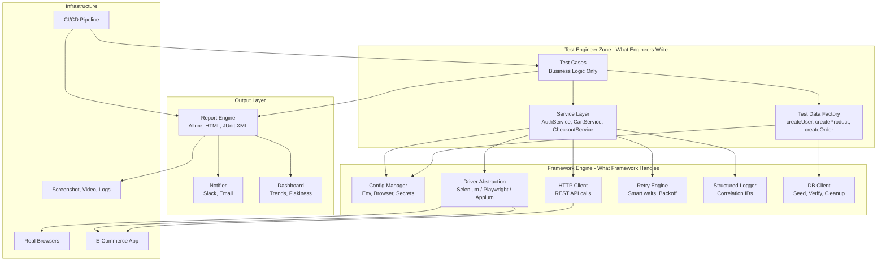

---

### 1.3 The Two-World Boundary

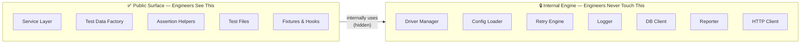

---

### 1.4 Full End-to-End Flow

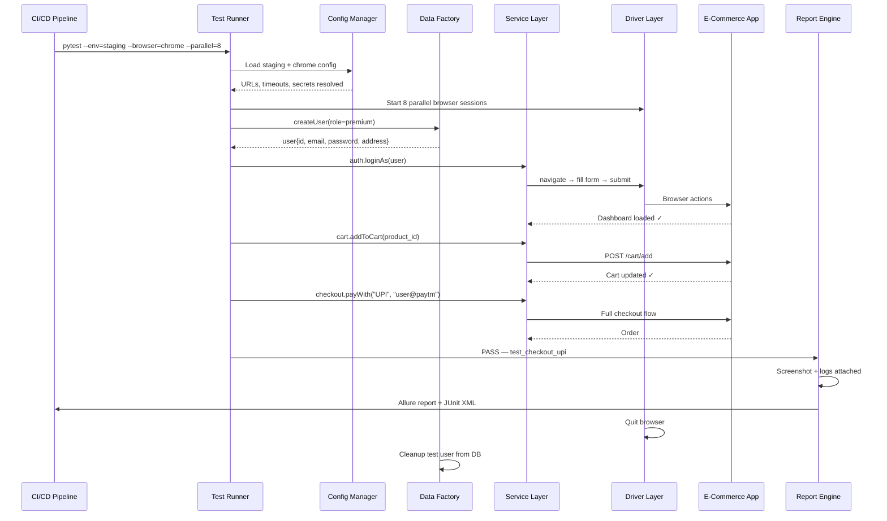

---

## PART 2 — Complete Folder Structure

```
ecommerce_test_framework/
│
├── 📁 config/                          # All configuration files
│   ├── base.yaml                       # Shared config (timeouts, retries)
│   ├── dev.yaml                        # Dev environment config
│   ├── qa.yaml                         # QA environment config
│   ├── staging.yaml                    # Staging environment config
│   └── prod.yaml                       # Prod environment (read-only tests)
│
├── 📁 framework/                       # Core framework engine (Internal - engineers don't touch)
│   │
│   ├── 📁 core/                        # Heart of the framework
│   │   ├── __init__.py
│   │   ├── config_manager.py           # Loads + merges all config
│   │   ├── driver_manager.py           # Spawns and manages browser sessions
│   │   ├── http_client.py              # Wrapper around requests/httpx
│   │   ├── retry_engine.py             # Smart retry with exponential backoff
│   │   ├── logger.py                   # Structured logger with correlation IDs
│   │   ├── db_client.py                # DB connection + query helpers
│   │   └── secrets_manager.py          # Loads secrets from env vars / vault
│   │
│   ├── 📁 drivers/                     # Driver abstraction layer
│   │   ├── __init__.py
│   │   ├── base_driver.py              # Abstract BrowserClient interface
│   │   ├── selenium_adapter.py         # Selenium implementation of BrowserClient
│   │   ├── playwright_adapter.py       # Playwright implementation of BrowserClient
│   │   └── appium_adapter.py           # Appium implementation for mobile
│   │
│   └── 📁 reporting/                   # Reporting engine
│       ├── __init__.py
│       ├── event_bus.py                # Publishes test events (started, passed, failed)
│       ├── allure_reporter.py          # Subscribes to events, builds Allure report
│       ├── junit_reporter.py           # Generates JUnit XML for CI integration
│       ├── slack_notifier.py           # Sends Slack alerts on suite completion
│       └── screenshot_handler.py       # Auto-captures screenshots on failure
│
├── 📁 services/                        # Public Service Layer (What test engineers use)
│   ├── __init__.py
│   ├── auth_service.py                 # Login, logout, session management
│   ├── search_service.py               # Search products, apply filters
│   ├── product_service.py              # PDP interactions, variant selection
│   ├── cart_service.py                 # Add/remove items, verify cart state
│   ├── checkout_service.py             # Address, payment, order placement
│   ├── order_service.py                # Order history, status, cancellation
│   ├── user_service.py                 # Profile, addresses, preferences
│   ├── admin_service.py                # Admin panel operations
│   └── returns_service.py              # Return/refund initiation and tracking
│
├── 📁 data/                            # Test Data Layer
│   ├── 📁 factory/                     # Programmatic data generation
│   │   ├── __init__.py
│   │   ├── user_factory.py             # Generates user objects (guest, premium, admin)
│   │   ├── product_factory.py          # Generates product data (electronics, fashion)
│   │   ├── order_factory.py            # Generates order scenarios
│   │   ├── payment_factory.py          # Generates payment details (UPI, card, COD)
│   │   └── address_factory.py          # Generates valid Indian/global addresses
│   │
│   ├── 📁 static/                      # Static test data files
│   │   ├── users.json                  # Predefined test user accounts
│   │   ├── products.json               # Product SKUs, prices, categories
│   │   ├── coupons.json                # Valid/invalid coupon codes
│   │   └── addresses.json              # Address datasets for different regions
│   │
│   ├── 📁 providers/                   # Data-driven test data supply
│   │   ├── __init__.py
│   │   ├── json_provider.py            # Reads from JSON files
│   │   ├── csv_provider.py             # Reads from CSV for data-driven tests
│   │   └── db_provider.py              # Queries live test DB for data
│   │
│   └── cleanup_registry.py             # Tracks and cleans up all created test data
│
├── 📁 pages/                           # Page Object Layer (UI element locators only)
│   ├── __init__.py
│   ├── base_page.py                    # Shared page methods (wait, scroll, screenshot)
│   ├── login_page.py                   # Login page locators and low-level actions
│   ├── home_page.py                    # Home page locators
│   ├── search_results_page.py          # Search results locators + pagination
│   ├── product_detail_page.py          # PDP locators (price, variants, add-to-cart)
│   ├── cart_page.py                    # Cart page locators
│   ├── checkout_page.py                # Checkout steps locators
│   ├── payment_page.py                 # Payment options locators
│   ├── order_confirmation_page.py      # Order success page locators
│   └── admin/
│       ├── admin_dashboard_page.py     # Admin panel pages
│       └── order_management_page.py
│
├── 📁 assertions/                      # Custom assertion helpers
│   ├── __init__.py
│   ├── order_assertions.py             # assertOrderStatus(), assertOrderTotal()
│   ├── cart_assertions.py              # assertCartCount(), assertCartTotal()
│   ├── product_assertions.py           # assertPriceMatch(), assertInStock()
│   └── ui_assertions.py                # assertPageTitle(), assertElementVisible()
│
├── 📁 tests/                           # Actual test files (What engineers write)
│   ├── 📁 e2e/                         # End-to-end test flows
│   │   ├── test_guest_checkout.py      # Full guest checkout flow
│   │   ├── test_logged_in_checkout.py  # Checkout as logged-in user
│   │   ├── test_checkout_with_coupon.py
│   │   ├── test_upi_payment.py
│   │   ├── test_card_payment.py
│   │   └── test_cod_payment.py
│   │
│   ├── 📁 functional/                  # Feature-level functional tests
│   │   ├── 📁 auth/
│   │   │   ├── test_login.py
│   │   │   ├── test_registration.py
│   │   │   └── test_forgot_password.py
│   │   ├── 📁 search/
│   │   │   ├── test_search_by_keyword.py
│   │   │   ├── test_search_filters.py
│   │   │   └── test_search_sorting.py
│   │   ├── 📁 cart/
│   │   │   ├── test_add_to_cart.py
│   │   │   ├── test_remove_from_cart.py
│   │   │   └── test_cart_persistence.py
│   │   ├── 📁 product/
│   │   │   ├── test_product_detail.py
│   │   │   └── test_variant_selection.py
│   │   └── 📁 orders/
│   │       ├── test_order_history.py
│   │       ├── test_order_cancellation.py
│   │       └── test_returns_and_refunds.py
│   │
│   ├── 📁 api/                         # API-level tests
│   │   ├── test_auth_api.py
│   │   ├── test_cart_api.py
│   │   ├── test_checkout_api.py
│   │   └── test_order_api.py
│   │
│   ├── 📁 smoke/                       # Quick sanity checks
│   │   ├── test_smoke_login.py
│   │   ├── test_smoke_search.py
│   │   └── test_smoke_checkout.py
│   │
│   └── 📁 regression/                  # Full regression suite
│       └── test_full_regression.py     # Runs all suites together
│
├── 📁 fixtures/                        # Pytest fixtures (Setup/Teardown hooks)
│   ├── __init__.py
│   ├── browser_fixtures.py             # Start/stop browser per test or session
│   ├── auth_fixtures.py                # Pre-logged-in user session
│   ├── data_fixtures.py                # Create + cleanup test data
│   └── api_fixtures.py                 # Pre-authenticated API session
│
├── 📁 utils/                           # Shared utility functions
│   ├── __init__.py
│   ├── date_utils.py                   # Date/time helpers
│   ├── string_utils.py                 # String manipulation helpers
│   ├── file_utils.py                   # Read/write files, parse JSON/CSV
│   ├── wait_utils.py                   # Custom wait conditions
│   └── random_utils.py                 # Generate random strings, numbers, UUIDs
│
├── 📁 reports/                         # Generated report output (gitignored)
│   ├── allure-results/                 # Raw Allure data
│   ├── allure-report/                  # Generated HTML report
│   ├── screenshots/                    # Failure screenshots
│   ├── videos/                         # Test execution videos
│   └── logs/                           # Run logs
│
├── 📁 .github/
│   └── 📁 workflows/
│       ├── run_smoke.yml               # Run smoke tests on every PR
│       ├── run_regression.yml          # Full regression on schedule
│       └── run_e2e.yml                 # E2E on deployment
│
├── conftest.py                         # Root pytest config + global fixtures
├── pytest.ini                          # Pytest settings (markers, log format)
├── requirements.txt                    # All Python dependencies
├── Makefile                            # Shortcut commands (make smoke, make regression)
├── Dockerfile                          # Container for CI execution
├── docker-compose.yml                  # Local multi-browser test setup
└── README.md                           # How to set up and run the framework
```

---

## PART 3 — What Each File Does and Why It Exists

### 3.1 Config Files (`config/`)

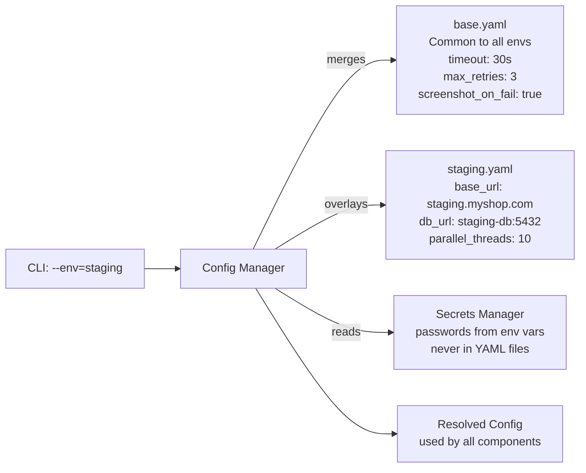

| File | What It Contains |
|---|---|
| `base.yaml` | Timeouts, retry counts, screenshot settings — shared by all environments |
| `dev.yaml` | `localhost:3000`, short timeouts, 2 parallel threads |
| `qa.yaml` | QA server URLs, medium timeouts, 5 threads |
| `staging.yaml` | Staging server, full retries, 10 parallel threads |
| `prod.yaml` | Prod URLs, read-only test settings, NO data seeding allowed |

---

### 3.2 Framework Core (`framework/core/`)

These files form the **internal engine**. Test engineers never import from here.

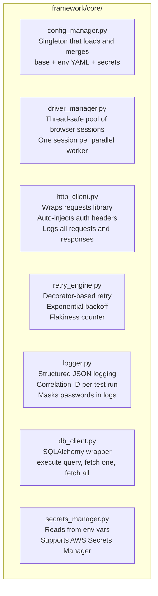

**Why `config_manager.py` is a Singleton:**
> Only one config object should exist per test run. If two components load config independently, they might get different values. Singleton guarantees everyone reads the same resolved config.

**Why `retry_engine.py` is a decorator:**
> Services annotate their methods with `@retry(max_attempts=3)`. The retry logic is centralized here — not scattered across every service method. Engineers never write retry loops.

---

### 3.3 Driver Abstraction (`framework/drivers/`)

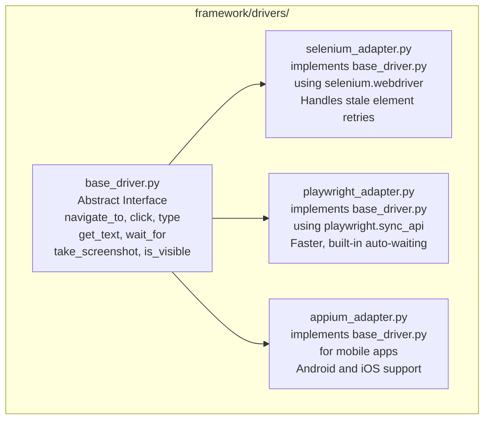

**Why this matters:**
> The `services/` layer only imports `base_driver.py`. It never knows whether Selenium or Playwright is running. Switching tools = changing one config flag. This is the **Adapter Pattern**.

---

### 3.4 Service Layer (`services/`)

This is the **most important folder** from the test engineer's perspective.

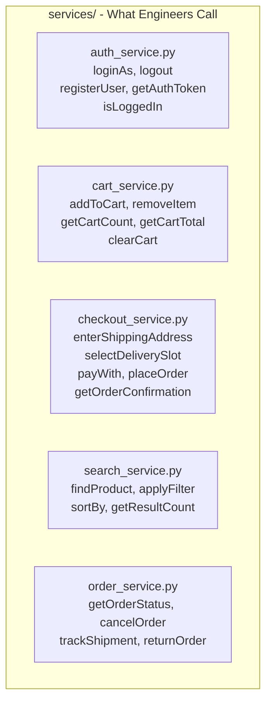

**Key Design Rule for Services:**
> Every method name must read as a business action. `loginAs(user)` not `fill_username_field_and_click_submit()`.
> Each service internally uses the page objects + driver + retry engine, but the engineer never sees that.

---

### 3.5 Page Object Layer (`pages/`)

Page objects hold **only UI locators and raw interactions**. They contain NO business logic.

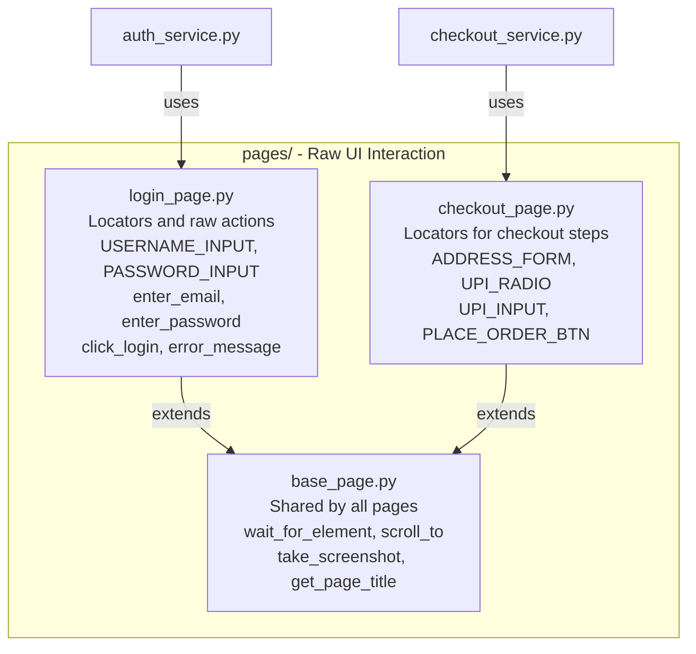

**Page Object vs. Service — Difference:**

| | Page Object (`pages/`) | Service (`services/`) |
|---|---|---|
| **Contains** | Locators + raw clicks/fills | Business-level actions |
| **Example** | `click_add_to_cart_button()` | `cart.addToCart(product_id)` — may call API or UI |
| **Who uses it** | Services only | Test engineers |
| **Business logic** | ❌ None | ✅ Yes |

---

### 3.6 Test Data Layer (`data/`)

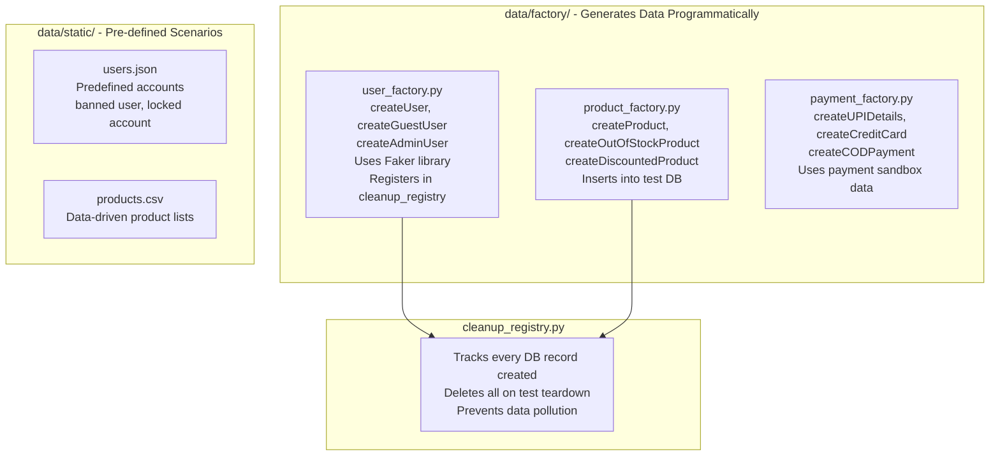

---

### 3.7 Fixtures (`fixtures/`)

Fixtures are **setup and teardown hooks** that run before/after tests. Engineers declare them — the framework runs them automatically.

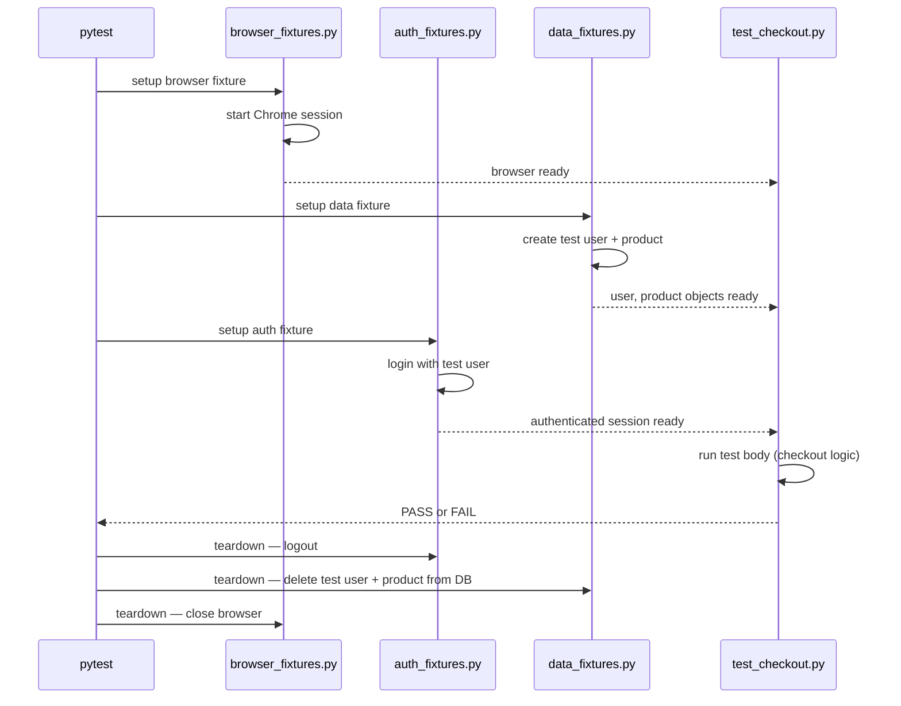

| Fixture File | What It Does |
|---|---|
| `browser_fixtures.py` | Starts browser before test, closes it after — scoped to test or session |
| `auth_fixtures.py` | Provides a pre-logged-in user session so tests don't repeat login steps |
| `data_fixtures.py` | Creates test data before test, deletes it after via cleanup registry |
| `api_fixtures.py` | Provides a pre-authenticated API session for API tests |

---

### 3.8 Reporting Layer (`framework/reporting/`)

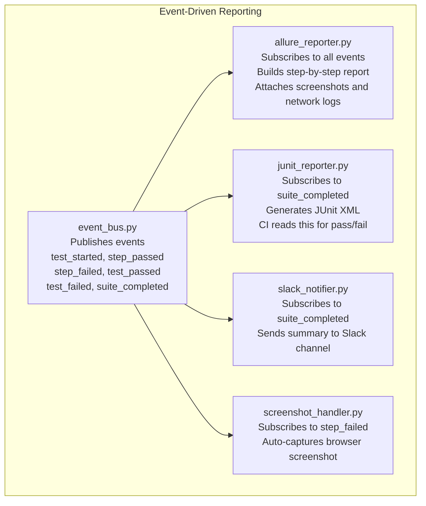

**Why Event-Driven?**
> Services call `event_bus.emit("step_passed", step_name)`. The reporter subscribes. If you want to add a new reporter (Grafana, Datadog), you just subscribe to the event bus — **zero changes to services or test cases**. This is the **Observer Pattern**.

---

### 3.9 Root Level Files

| File | Purpose |
|---|---|
| `conftest.py` | Root pytest config. Registers all fixtures. Hooks for pre/post suite actions |
| `pytest.ini` | Pytest settings: markers definition, log format, test discovery paths |
| `requirements.txt` | All dependencies: selenium, playwright, pytest, allure, faker, sqlalchemy |
| `Makefile` | Shortcuts: `make smoke`, `make regression`, `make report` |
| `Dockerfile` | Packages the framework + browsers into a container for CI |
| `docker-compose.yml` | Local multi-browser setup (Chrome + Firefox + Selenium Grid) |
| `README.md` | Setup guide, how to run tests, how to add new tests |

---

## PART 4 — Architecture Component Interaction Map

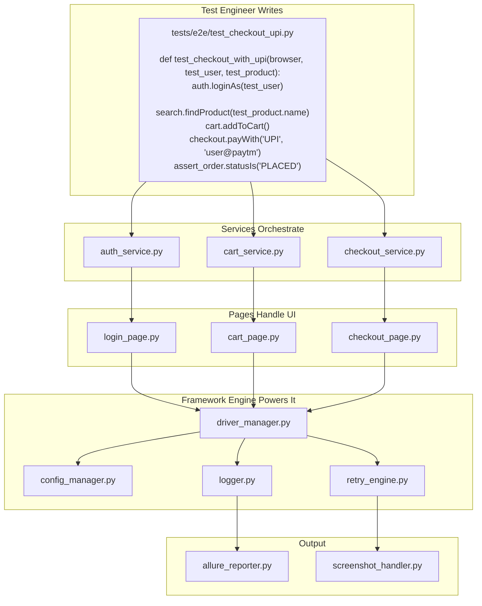

---

## PART 5 — Design Patterns Summary

| Pattern | File(s) | Why Used |
|---|---|---|
| **Facade** | `services/*.py` | One simple method hides 20 lines of Selenium code |
| **Adapter** | `framework/drivers/` | Swap Selenium/Playwright behind a common interface |
| **Factory** | `data/factory/*.py` | Create complex data objects with one method call |
| **Singleton** | `framework/core/config_manager.py` | One shared config for the entire test run |
| **Observer/Event** | `framework/reporting/event_bus.py` | Reporters subscribe to events without coupling to test code |
| **Strategy** | `data/providers/` | Swap data source (JSON/CSV/DB) at runtime |
| **Page Object** | `pages/` | Isolate locators from business logic |
| **Builder** | `data/factory/order_factory.py` | Build complex objects step-by-step |

---

## PART 6 — Interview Answer Script

> Use this flow when asked the question:

**1️⃣ Frame the problem from the user's perspective:**
*"Before drawing any component, I ask: what does a test engineer actually need? They need to write test cases in business language, get ready-to-use test data, switch environments without changing code, and get clear reports when things fail. Every architectural decision follows from this."*

**2️⃣ Introduce the two-world boundary:**
*"I split the framework into two worlds. The public surface — Service Layer, Data Factory, Assertions — is what engineers touch. The internal engine — Driver Manager, Config Manager, Retry Engine, Reporter — is what the framework owns. Engineers never cross that boundary."*

**3️⃣ Walk through the folder structure:**
*"In terms of structure: `config/` holds environment configs, `framework/` is the internal engine, `services/` is the public API that engineers use, `pages/` holds UI locators, `data/` handles all test data, `tests/` is where engineers write their tests, `fixtures/` manages setup and teardown, and `reports/` is where output goes."*

**4️⃣ Call out two key architectural decisions:**
*"The most important decisions are: the Adapter Pattern on the driver layer so we can swap tools without touching tests, and the Event Bus on the reporting layer so reporters are fully decoupled — adding a new reporter means subscribing to an event, nothing else changes."*

---

## 🎯 Key Takeaway

> A well-designed framework has **exactly two responsibilities**:
> 1. Make writing tests as simple as possible for engineers
> 2. Handle all infrastructure complexity so engineers never have to

The folder structure is a direct reflection of this:
- `services/` and `data/` → engineer simplicity
- `framework/core/`, `framework/drivers/`, `framework/reporting/` → infrastructure complexity, hidden away
