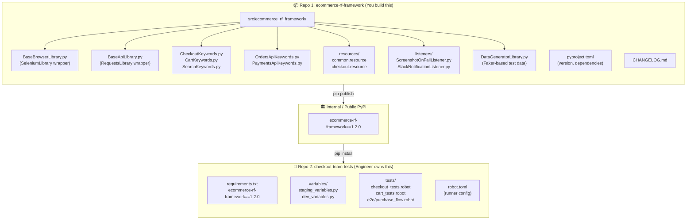
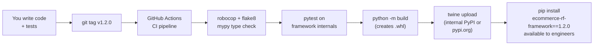
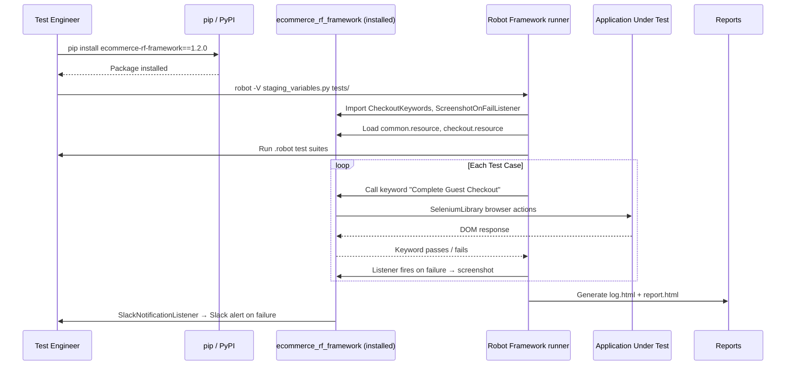

# E-Commerce Test Automation Framework — Design & Architecture
# Built with Python + Robot Framework
# Model: Framework Developer Publishes → Test Engineers Consume

> **Interview Question:** "If you were building a framework, how would you design its architecture and structure? What would be the scope?"

---

## 🧠 How to Approach This Answer

Structure your response around **5 pillars**:

1. **The Model** — Developer publishes, Engineers consume (two separate repos)
2. **Scope Definition** — What the framework provides vs what engineers write
3. **Design Principles** — What architectural decisions drive the design?
4. **System Architecture** — How do the layers/components interact?
5. **Folder Structure + Code** — Framework package and consumer project separately

---

## 🎯 The Core Model — Publish & Consume

```
┌───────────────────────────────┐      pip install      ┌──────────────────────────────┐
│   Framework Developer (You)   │  ─────────────────►   │   Test Engineer (Consumer)   │
│                               │                        │                              │
│  Builds & publishes:          │                        │  Creates their own project:  │
│  ecommerce-rf-framework       │                        │  checkout-team-tests/         │
│  (pip package)                │                        │  (uses the framework)         │
└───────────────────────────────┘                        └──────────────────────────────┘
```

> **You own the framework package. Engineers own their test projects.**
> These are two **separate repositories**. The framework is versioned, published, and installed like any other pip package.

---

## 🎯 E-Commerce Test Automation Framework (Robot Framework)

### 1. Scope

| Perspective | Scope |
|-------------|-------|
| **Framework provides** | Base Libraries, Keyword Libraries, Listeners, Variable File templates, Resource files |
| **Engineer provides** | `.robot` test suites, project-specific `variables/`, any custom extensions |
| **Test Types covered** | UI (SeleniumLibrary), API (RequestsLibrary), E2E flows |
| **Execution** | Local, CI/CD (GitHub Actions), parallel via pabot |
| **Reporting** | RF built-in log.html + report.html + Listener-driven Slack/Jira |
| **Out of Scope** | Performance testing (Gatling), security testing |

---

### 2. Core Design Principles

```
┌─────────────────────────────────────────────────────────────────┐
│  Design Principles for a Published Framework                    │
│                                                                 │
│  S — Single Responsibility  (each Library does one job)         │
│  O — Open/Closed            (extend Libraries, don't modify)    │
│  D — Dependency Injection   (Variable Files injected at runtime)│
│                                                                 │
│  + Stable Public API  — Published @keyword interface never      │
│                         breaks without a major version bump     │
│  + Versioned Releases — Engineers pin to a version              │
│                         (ecommerce-rf-framework==1.2.0)         │
│  + Zero Config Start  — Engineers can run first test in         │
│                         5 minutes of pip install                │
└─────────────────────────────────────────────────────────────────┘
```

---

### 3. Two-Repo Architecture



---

### 4. Framework Package — What You Build and Publish

#### Full Package Structure

```
ecommerce-rf-framework/              ← Your Git repository
│
├── 📁 src/
│   └── ecommerce_rf_framework/      ← The installable package
│       ├── __init__.py              # Version export: __version__ = "1.2.0"
│       │
│       ├── 📁 libraries/            # Python Keyword Libraries
│       │   ├── __init__.py
│       │   ├── BaseBrowserLibrary.py      # Core: browser open/close/waits
│       │   ├── BaseApiLibrary.py          # Core: HTTP session, auth header
│       │   ├── CheckoutKeywords.py        # Domain: checkout page keywords
│       │   ├── CartKeywords.py            # Domain: cart page keywords
│       │   ├── SearchKeywords.py          # Domain: search page keywords
│       │   ├── OrdersApiKeywords.py       # Domain: orders API keywords
│       │   ├── PaymentsApiKeywords.py     # Domain: payments API keywords
│       │   └── DataGeneratorLibrary.py    # Test data generator (Faker)
│       │
│       ├── 📁 resources/            # Bundled .resource files
│       │   ├── common.resource      # Login, logout, navigation keywords
│       │   ├── checkout.resource    # Complete Guest Checkout keyword
│       │   └── api_common.resource  # API auth setup/teardown
│       │
│       └── 📁 listeners/            # RF Listener hooks
│           ├── ScreenshotOnFailListener.py
│           ├── SlackNotificationListener.py
│           └── JiraDefectListener.py
│
├── 📁 tests/                        # Framework's own unit/integration tests
│   ├── test_base_browser_library.py
│   └── test_base_api_library.py
│
├── 📁 docs/
│   ├── getting_started.md           # "5-minute" onboarding
│   ├── keyword_reference.md         # Every @keyword documented
│   └── changelog.md
│
├── pyproject.toml                   # Build config, version, dependencies
├── CHANGELOG.md
└── README.md
```

---

### 5. Engineer's Consumer Project — What They Build

```
checkout-team-tests/                 ← Engineer's own Git repository
│
├── 📁 tests/
│   ├── 📁 ui/
│   │   ├── checkout_tests.robot     # Uses CheckoutKeywords from package
│   │   └── cart_tests.robot
│   ├── 📁 api/
│   │   └── orders_api_tests.robot   # Uses OrdersApiKeywords from package
│   └── 📁 e2e/
│       └── purchase_flow.robot
│
├── 📁 variables/
│   ├── staging_variables.py         # Their env-specific config
│   └── dev_variables.py
│
├── 📁 resources/                    # Optional: their own composed keywords
│   └── custom_checkout.resource     # Extends framework's checkout.resource
│
├── robot.toml                       # RF runner config (output dir, tags)
├── requirements.txt                 # ← ecommerce-rf-framework==1.2.0
└── README.md
```

---

### 6. pyproject.toml — Publishing the Framework

```toml
# pyproject.toml  (inside your framework repo)

[build-system]
requires = ["hatchling"]
build-backend = "hatchling.build"

[project]
name = "ecommerce-rf-framework"
version = "1.2.0"
description = "Robot Framework library for e-commerce test automation"
requires-python = ">=3.10"

dependencies = [
    "robotframework>=6.0",
    "robotframework-seleniumlibrary>=6.0",
    "robotframework-requests>=0.9",
    "faker>=20.0",
    "pydantic>=2.0",       # Variable file validation
]

[project.optional-dependencies]
dev = [
    "pytest",
    "robocop",             # RF static analysis
    "mypy",
    "flake8",
]

# This ensures resource files are included in the package
[tool.hatch.build.targets.wheel]
packages = ["src/ecommerce_rf_framework"]
```

---

### 7. Publishing Workflow



---

### 8. Engineer's Onboarding — How They Use It

#### Step 1: Install the framework
```bash
pip install ecommerce-rf-framework==1.2.0
# or from internal PyPI:
pip install ecommerce-rf-framework==1.2.0 --index-url https://pypi.internal.company.com
```

#### Step 2: Write a test — importing framework keywords
```robotframework
# tests/checkout_tests.robot  ← Engineer writes this

*** Settings ***
Documentation    Checkout flow tests for the e-commerce platform.

# Import Keyword Libraries from the installed framework package
Library     ecommerce_rf_framework.libraries.CheckoutKeywords
Library     SeleniumLibrary

# Import Resource files bundled inside the package
Resource    ${CURDIR}/../../lib/python3.11/site-packages/ecommerce_rf_framework/resources/common.resource

# Or use a helper to find the resource path (recommended pattern)
Variables   ecommerce_rf_framework.variables.paths    # exposes FRAMEWORK_RESOURCES_DIR

Suite Setup       Open Browser    ${BASE_URL}    ${BROWSER}
Suite Teardown    Close All Browsers
Test Tags         checkout    regression

*** Variables ***
${PRODUCT_NAME}    Running Shoes XL

*** Test Cases ***

Guest User Can Complete Purchase
    [Tags]    smoke    p1
    ${order_id}=    Complete Guest Checkout    ${PRODUCT_NAME}
    Should Not Be Empty    ${order_id}
```

#### Step 3: Configure their environment
```python
# variables/staging_variables.py  ← Engineer creates this

BASE_URL      = "https://staging.ecommerce.com"
API_BASE_URL  = "https://api.staging.ecommerce.com"
BROWSER       = "chrome"
HEADLESS      = True
TIMEOUT       = "10s"
```

#### Step 4: Run tests
```bash
robot \
  -V variables/staging_variables.py \
  --listener ecommerce_rf_framework.listeners.ScreenshotOnFailListener \
  --listener ecommerce_rf_framework.listeners.SlackNotificationListener \
  --outputdir reports/ \
  tests/
```

---

### 9. How Listeners Are Used by Engineers (Zero Friction)

Engineers don't write any screenshot or notification code. They just pass the Listener class path on the command line — or configure it in `robot.toml`:

```toml
# robot.toml  (engineer's project)

[options]
outputdir = reports
loglevel = INFO

# Listeners from the installed framework package
listener = [
  "ecommerce_rf_framework.listeners.ScreenshotOnFailListener",
  "ecommerce_rf_framework.listeners.SlackNotificationListener:https://hooks.slack.com/xxxx"
]

# Variable file pointing to staging
variablefile = ["variables/staging_variables.py"]
```

> **Result**: Engineers get automatic screenshots on failure, Slack alerts, Jira tickets — just by installing the package and adding 3 lines to `robot.toml`. No code to write.

---

### 10. System Execution Flow



---

### 11. Versioning — Protecting Engineers from Breaking Changes

```
Semantic Version: MAJOR.MINOR.PATCH

PATCH  1.2.0 → 1.2.1   Bug fix in keyword. No API change. Safe to upgrade.
MINOR  1.2.0 → 1.3.0   New keyword added. Backward compatible. Safe to upgrade.
MAJOR  1.2.0 → 2.0.0   Keyword renamed or removed. BREAKING. Engineers must update their .robot files.
```

```markdown
# CHANGELOG.md  (you maintain this)

## [2.0.0] - 2025-06-01  ← BREAKING
### Changed
- BREAKING: `Fill Shipping Details` now requires `postal_code` argument (was optional)
### Migration
Before: `Fill Shipping Details    John    123 Main St    NYC`
After:  `Fill Shipping Details    John    123 Main St    NYC    10001`

## [1.3.0] - 2025-05-15  ← Safe upgrade
### Added
- New keyword: `Verify Order Status On Confirmation Page`
- New keyword: `Apply Discount Code`
```

---

### 12. Keyword Reference — What You Document for Engineers

> Engineers should only need to read the keyword reference to write tests. They should never need to read your source code.

```markdown
# keyword_reference.md

## CheckoutKeywords

### Fill Shipping Details
**Arguments**: `first_name`, `address`, `city`, `postal_code`
**Description**: Fills in the shipping form on the checkout page.
**Example**:
    Fill Shipping Details    John Doe    123 Main St    New York    10001

### Place Order And Get Order ID
**Returns**: `str` — the confirmed order ID from the confirmation page
**Waits for**: Order confirmation page to fully load (up to TIMEOUT)
**Example**:
    ${order_id}=    Place Order And Get Order ID
    Should Not Be Empty    ${order_id}
```

---

### 13. Concept Mapping — pytest vs Robot Framework (Published Package Model)

| Concept | pytest + Selenium (single repo) | RF Published Package Model |
|---------|--------------------------------|---------------------------|
| Page Objects | `BasePage` class in same repo | `CheckoutKeywords.py` in published package |
| Test files | `.py` in same repo | `.robot` in engineer's own repo |
| Config | `conftest.py` fixtures | `Variable Files` in engineer's project |
| Hooks | `@decorator` in same repo | `Listeners` from installed package |
| Parallel | `pytest-xdist` in same repo | `pabot` CLI used by engineer |
| Reporting | Allure plugin (manual setup) | RF built-in + Listeners from package |
| Distribution | Copy-paste / monorepo | `pip install ecommerce-rf-framework` |
| Versioning | Git branch | Semantic version: `==1.2.0` in requirements.txt |

---

### 14. Talking Points Cheat Sheet

#### 🔹 On the publish-consume model
> *"I separate my role from the engineer's role completely. I am the framework author — I build, version, and publish the package. The test engineers are consumers — they pip install it, write .robot test files, and never touch my source code. This separation means I can improve the framework internals without breaking their tests, as long as I maintain the keyword API contract."*

#### 🔹 On versioning
> *"Engineers pin to a specific version in requirements.txt — `ecommerce-rf-framework==1.2.0`. If I release a minor update adding new keywords, they can upgrade safely. If I need to rename a keyword, that's a major version bump and I document the migration in CHANGELOG.md. Engineers upgrade on their own schedule."*

#### 🔹 On zero-friction onboarding
> *"The engineer's onboarding is: pip install, write a .robot file, add the Listener to robot.toml, run. That's it. They get screenshots on failure, Slack alerts, and Jira ticket creation — all from the installed package — without writing a single line of hook code."*

#### 🔹 On keyword stability (the API contract)
> *"A published @keyword is a public API contract. If I rename `Fill Shipping Details` to `Enter Shipping Information`, every engineer's `.robot` file breaks. So I treat keyword names the same way a library author treats public function names — you add, you don't rename or remove without a major version bump."*

#### 🔹 On what engineers never touch
> *"Engineers never see or touch my Listener code, my BaseBrowserLibrary, my SeleniumLibrary configuration. They just call keyword names. That abstraction is the whole point — I handle the hard engineering, they write readable test cases."*

---

### 15. Common Follow-Up Questions

| Follow-Up | Answer |
|-----------|--------|
| *"How do engineers extend your framework?"* | They inherit from your Keyword Libraries in their own Python files inside their project, or compose new Resource files from your bundled ones |
| *"What if an engineer needs a keyword you haven't built yet?"* | They create a local Keyword Library in their project, import it alongside yours — no need to wait for a framework release |
| *"How do you handle breaking changes?"* | Major version bump + CHANGELOG.md migration guide + deprecation period where old keyword still works but logs a warning |
| *"How do engineers report bugs in your framework?"* | GitHub Issues on the framework repo — bug fix goes into a PATCH release same week |
| *"How do you test the framework itself?"* | Framework internals have their own `pytest` unit tests. Before publishing, CI runs both unit tests and a smoke test `.robot` file against a test e-commerce app |

---

> 💡 **Core Interview Principle**:
> *"I build and publish the framework. Engineers install and use it. They are my users. My job is to make their job simple, predictable, and well-documented. The quality of my framework is measured by how little they need to know about my implementation."*
