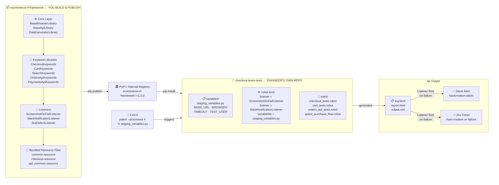

# How to Actually Explain Framework Design in an Interview
# (Robot Framework Edition)

> **The Goal**: You should sound like someone who has *built* this framework, not someone who *read about* it.
> The interviewer is not testing your memory. They are testing **how you think**.

---

## 🏗️ STEP 0 — Start With the Foundation: What Even IS a Framework?

> *This is your opening hook. Most candidates skip this and jump straight into components. Don't.*
> *Starting here immediately signals that you think at a conceptual level — not just a tooling level.*

**What to say:**

> "Before I describe the architecture, let me establish what we mean by a 'framework' — because there's an important distinction between a module, a package, a library, and a framework. That distinction is actually the foundation of every design decision I'll explain."

---

### The Progression — Module → Package → Library → Framework

#### 🔹 Module
> *"A module is the smallest unit — a single Python file with related functions or classes."*

```python
# locators.py  ← This is a module
CHECKOUT_BTN   = "css:#checkout-btn"
CART_ICON      = "css:.cart-icon"
SEARCH_BAR     = "id:search-input"
```

> *"It solves one small problem. You import it. You control when and how it's used."*

---

#### 🔹 Package
> *"A package is a collection of related modules organized into a directory."*

```
libraries/
├── __init__.py
├── checkout_keywords.py    ← module
├── cart_keywords.py        ← module
└── search_keywords.py      ← module
```

> *"Still just organized code. You're still in complete control of the flow."*

---

#### 🔹 Library
> *"A library is a collection of packages that gives you reusable functionality. You call it when you need it. You decide the flow."*

```python
# You call SeleniumLibrary — YOU are in control
from SeleniumLibrary import SeleniumLibrary
sl = SeleniumLibrary()
sl.open_browser("https://shop.com", "chrome")   # You decide when
sl.click_element("css:#login-btn")              # You decide what order
sl.close_browser()
```

> *"SeleniumLibrary, RequestsLibrary, Faker — these are all libraries. Powerful, but they don't give you structure. Five engineers using the same library will write code in five completely different ways."*

---

#### 🔹 Framework
> *"A framework flips the relationship. You don't call the framework — **the framework calls you**."*

```robotframework
*** Test Cases ***
Guest User Can Purchase
    Complete Guest Checkout    Running Shoes XL    # YOU define this keyword
    # Robot Framework controls: when setup runs, when teardown runs,
    # how failures are handled, how reports are generated — not you.
```

> *"This is called the **Hollywood Principle** — 'Don't call us, we'll call you'.*
> *Robot Framework controls the execution lifecycle. It calls your Keywords, manages Suite Setup and Teardown, generates reports, fires Listeners on failure. You provide the domain logic. The framework provides the structure.*
>
> *That inversion of control is what makes it a framework — not just a collection of libraries."*

---

### The Key Distinction in One Table

| Concept | Who controls the flow? | Example in our stack |
|---------|----------------------|---------------------|
| **Module** | You | `locators.py` (just locator constants) |
| **Package** | You | `libraries/` directory (organized modules) |
| **Library** | You | SeleniumLibrary, RequestsLibrary, Faker |
| **Framework** | **The framework** | Robot Framework (calls your Keywords, manages lifecycle) |

---

### WHY a Framework — Not Just Libraries?

**What to say:**

> "I could have written this e-commerce test suite using pure Python with SeleniumLibrary called directly. So why build a framework on top of Robot Framework?
>
> **Three reasons:**
>
> **1. Structure is enforced, not requested.**
> A library gives you tools. A framework gives you *rules*. When five automation engineers use SeleniumLibrary directly, you get five different patterns. When they work inside Robot Framework, they all write keywords and test cases — the structure is non-negotiable.
>
> **2. You get lifecycle management for free.**
> Suite Setup, Test Setup, Teardown, parallel execution via pabot, screenshot-on-fail via Listeners — the framework handles all of this. I don't build it. I configure it. That's weeks of engineering saved.
>
> **3. Tests read like plain English.**
> Because Robot Framework controls the execution, what engineers write in `.robot` files is just vocabulary — keyword names. A product manager can read `Complete Guest Checkout` and understand exactly what the test does. You can't achieve that level of readability with raw library calls."

---

### The One-Line Summary to Deliver This Idea

> *"A library is a tool you pick up and put down. A framework is an environment you live inside. I chose Robot Framework because I want the framework to enforce structure and own the lifecycle — so my engineers only have to think about test logic, not infrastructure."*

---

---

## 🎯 The Second Mindset Shift — Clarify Your Role First

> *Before answering the design question, tell the interviewer WHO you are in this story.*

Most candidates answer by listing components:
> *"I would have a BasePage class, a config manager, a data layer..."*

That is **not** what the interviewer wants. They want to hear you **reason through problems and make decisions**.

The winning structure is:
```
Your Role → Problem → Decision → Design → Usage → Tradeoffs
```

**Lead with your role:**
> *"My role is the framework developer. I build, version, and publish the framework as a pip package. Test engineers are the consumers — they install it and write test suites without touching my code. Everything I design must serve that boundary."*

Think of it like being an open-source library author. The engineers are your users. Their productivity is your metric.

---

## 🗣️ The Complete Verbal Answer — Step by Step

---

### STEP 1 — Establish Your Role and the Problem (First 45 seconds)

> *Never jump into components. First say WHO you are and WHY the framework exists.*

**What to say:**

> "Let me first clarify my role here — I am the framework developer, not the test engineer. My job is to design, build, and publish this as a pip package. The test engineers install it and use it. They never modify my code. That separation is the most important design decision I'll make.
>
> Now — why does this framework exist at all?
>
> Imagine 5 automation engineers testing an e-commerce platform — checkout, cart, payments, search. Without a shared foundation, each engineer writes their own SeleniumLibrary setup, their own waits, their own helper functions. You get 5 different styles, duplicated locators scattered across projects, and when the checkout button changes its selector — 5 engineers update 50 test files each.
>
> My framework solves this: engineers pip install one package and immediately get Keyword Libraries for every part of the application, automatic screenshots on failure via Listeners, and a reporting system — without writing a single line of infrastructure code."

**Why this works**: You've established your role as the *author*, the problem engineers face, and the value your package delivers — all in 45 seconds.

---

### STEP 2 — Define the Scope (Next 60 seconds)

> *Scoping has TWO dimensions now: what the framework provides, and what engineers provide.*

**What to say:**

> "Scope works at two levels here.
>
> **What my framework package provides:**
> - Keyword Libraries for all e-commerce UI flows — checkout, cart, search, product pages — built on SeleniumLibrary
> - API Keyword Libraries for orders, payments, products — built on RequestsLibrary
> - Listeners already wired — screenshot on failure, Slack alert, Jira ticket creation
> - A DataGeneratorLibrary with Faker to create realistic test users, addresses, and orders
>
> **What the test engineer provides in their own project:**
> - Their `.robot` test suite files — the actual test cases
> - Their Variable Files — `staging_variables.py`, `dev_variables.py` — with environment-specific URLs and credentials
> - Optional: their own custom Resource files that compose my keywords into higher-level flows
>
> **Out of scope for the framework:**
> - Performance load testing — separate tool like Gatling
> - Security testing — dedicated pentest team
>
> This two-level scope prevents scope creep — my framework doesn't try to own everything."

**Pro tip**: Pause here and say *"Does that split make sense — what I publish vs what engineers write?"*

---

### STEP 3 — Walk Through the Architecture in Plain English (2-3 minutes)

> *Draw this on the whiteboard if there is one. Speak from bottom to top.*

**What to draw / explain:**

```
┌─────────────────────────────────────────┐
│       CI/CD  /  robot / pabot CLI       │  ← How tests are triggered
├─────────────────────────────────────────┤
│         Test Suite Layer (.robot)       │  ← What engineers write
│  (checkout_tests.robot, cart_tests...)  │
├─────────────────────────────────────────┤
│     Resource Files + Keyword Libraries  │  ← Domain abstraction
│  (checkout.resource, CheckoutKeywords,  │
│   OrdersApiKeywords...)                 │
├─────────────────────────────────────────┤
│          Framework Core (Python)        │  ← What I build and own
│  (BaseBrowserLibrary, BaseApiLibrary,   │
│   Variable Files, Listeners)            │
├─────────────────────────────────────────┤
│         Application Under Test          │  ← The e-commerce site
└─────────────────────────────────────────┘
```

**What to say as you draw each layer:**

> **Core (bottom layer):**
> "I start with the Core — written in Python, this is the engine. Engineers should never need to modify this. It handles:
> - **Variable Files**: plain Python files that define BASE_URL, credentials, timeouts per environment. You pass `-V variables/staging_variables.py` at runtime
> - **BaseBrowserLibrary**: wraps SeleniumLibrary — opens browsers, manages sessions, sets timeouts
> - **BaseApiLibrary**: wraps RequestsLibrary — manages HTTP sessions, injects auth headers
> - **Listeners**: RF's hook system — `ScreenshotOnFailListener` auto-captures a screenshot on every keyword failure, without engineers writing a single extra line"

> **Keyword Library / Resource layer:**
> "On top of that, I build Keyword Libraries — Python classes where methods become RF keywords. The `CheckoutKeywords` library knows all the checkout page's locators and actions. Engineers call `Fill Shipping Details` — they never see the CSS selector. If the UI changes, I update one Library class. Zero test files change. This is the Robot Framework equivalent of the Page Object Model."

> **Test Suite layer (.robot files):**
> "Then the test suites — `.robot` files. This is where engineers spend 90% of their time. A test case reads like a user story:
> ```robotframework
> Guest User Can Complete Full Purchase
>     ${order_id}=    Complete Guest Checkout    Running Shoes XL
>     Should Not Be Empty    ${order_id}
> ```
> Plain English. No locators, no browser setup, no waits — the framework handles all of that."

---

### STEP 4 — Explain the Key Design Decisions (Show You Think Deeply)

> *This is where you separate yourself from average candidates. Talk about WHY.*

#### Decision 1: Why Keyword Libraries instead of raw SeleniumLibrary calls?

**What to say:**
> "In RF, you could call SeleniumLibrary directly in test files — `Click Element   css:#checkout-btn`. But then the locator lives in the test file.
>
> I enforce a rule: **no locator ever lives in a .robot test file**. All locators live in Python Keyword Libraries. If the checkout button's ID changes, I update `CheckoutKeywords.py` once. Every test that calls `Place Order` gets the fix automatically. That's O(1) maintenance instead of O(n).
>
> This is the Robot Framework equivalent of the Page Object Model pattern."

#### Decision 2: Why Variable Files instead of hardcoded values?

**What to say:**
> "Variable Files are plain Python files that RF loads at runtime. You run with `-V variables/staging_variables.py` and every test gets the staging URL, credentials, and timeouts automatically.
>
> The key insight: the same `.robot` test file runs unchanged on dev, staging, and prod. Only the `-V` argument changes. This is critical for CI/CD — your regression suite runs on staging without a single code change."

#### Decision 3: Why RF Listeners for hooks?

**What to say:**
> "Robot Framework has a Listener API — Python classes that receive events for every keyword start, end, test pass, and test fail. I implement a `ScreenshotOnFailListener` that captures a screenshot automatically when any keyword fails.
>
> The benefit: engineers don't write `Capture Page Screenshot` in every test. It happens automatically at the framework level. When I improve the logic — add timestamps, upload to S3 — zero test files change. That's the Open/Closed principle."

---

### STEP 5 — Show How an Engineer Uses It Day-to-Day (Makes It Real)

> *This is the part most candidates completely miss. Show the full journey from install to test.*

**What to say:**

> "Let me walk through exactly what the engineer's experience looks like — because this is what the framework is really designed for.
>
> **Day 1 — Onboarding (under 5 minutes):**
> ```bash
> # Engineer's project — separate repo from mine
> mkdir checkout-team-tests && cd checkout-team-tests
>
> # Step 1: Install my published framework
> pip install ecommerce-rf-framework==1.2.0
>
> # Step 2: Create their staging variable file
> # variables/staging_variables.py:
> #   BASE_URL = 'https://staging.ecommerce.com'
> #   BROWSER  = 'chrome'
>
> # Step 3: Write their first test
> # tests/checkout_tests.robot:
> #   Library  ecommerce_rf_framework.libraries.CheckoutKeywords
> #   Guest User Can Purchase
> #       ${order_id}=  Complete Guest Checkout  Running Shoes XL
> #       Should Not Be Empty  ${order_id}
>
> # Step 4: Run
> robot -V variables/staging_variables.py tests/checkout_tests.robot
> ```
> RF generates `log.html` automatically. First test running in under 5 minutes.
> The engineer never looked at my source code.
>
> **Day 2 — Something goes wrong — no screenshot in log:**
> They add one line to `robot.toml`:
> ```toml
> listener = ['ecommerce_rf_framework.listeners.ScreenshotOnFailListener']
> ```
> Done. Every future failure now auto-captures a screenshot. Zero Python written.
>
> **Day 3 — They need a keyword I haven't built yet:**
> They create a local `libraries/MyCustomKeywords.py` in their own project, write the `@keyword` methods, import it alongside mine. They don't wait for me to publish a new version.
>
> This matters because the framework's job is not just to be technically correct — it's to make engineers autonomous."


---

### STEP 6 — Talk About Extensibility and What You'd Add Later

> *Shows you think beyond the current version — a senior engineering trait.*

**What to say:**

> "The framework is designed to grow without breaking what exists:
>
> - **New browser**: change `BROWSER` in the variable file — zero keyword changes
> - **Mobile testing**: add an Appium-based `MobileBaseLibrary` alongside `BaseBrowserLibrary` — existing tests untouched
> - **New notification** (Teams instead of Slack): write a new Listener class, plug it in via CLI — existing Listeners still work
> - **New environment**: add `prod_variables.py` — no code changes anywhere
>
> The design principle: **adding new capability should not require modifying existing keywords or test files**. That's the Open/Closed principle applied to Robot Framework."

---

### STEP 7 — Handle the "What About Scale?" Follow-Up

> *Interviewers almost always ask this. Be ready.*

**What to say:**

> "For scale, two things matter: test isolation and parallel execution.
>
> Every test must be **stateless** — it creates its own data, tears it down in Test Teardown. No test depends on another test's state. This is what lets you run them in any order and in parallel.
>
> For parallel execution, I use **pabot** — Parallel Robot Framework executor. You run `pabot --processes 4 tests/` and it distributes test suites across 4 parallel workers. In CI, I split suites across matrix jobs — UI tests, API tests, and E2E tests all running simultaneously.
>
> The key design rule: **no shared mutable state between tests**. Each test gets its own browser session, its own test data. If two tests share a database record, you'll get race conditions — no tool will save you. You must design for isolation first."

---

## 🏗️ The Whiteboard Walk-Through (If They Ask You to Draw It)

> *Do this in exactly this order — it tells the full story including the publish step*

**Step 1** — Draw TWO boxes side by side:
- Left: `ecommerce-rf-framework` (your repo — pip package)
- Right: `checkout-team-tests` (engineer's repo — consumer)
- Arrow between them labeled: `pip install ecommerce-rf-framework==1.2.0`

**Step 2** — Inside the LEFT box (your framework), draw layers bottom to top:
- `BaseBrowserLibrary` / `BaseApiLibrary` (Python core)
- `CheckoutKeywords`, `CartKeywords`, `OrdersApiKeywords` (domain Keywords)
- `ScreenshotOnFailListener`, `SlackNotificationListener` (Listeners)
- Bundled `common.resource`, `checkout.resource` (Resource files)

**Step 3** — Inside the RIGHT box (engineer's project):
- `variables/staging_variables.py` (their environment config)
- `tests/checkout_tests.robot` (their test suites)
- `robot.toml` (wires in your Listeners)

**Step 4** — Arrow from left: `CI/CD → pabot → -V staging_variables.py → .robot suites`

**Step 5** — Arrow on right: `Results → log.html → Listener → Slack / Jira`

---

### 🖼️ Mermaid Diagram (The Exact Same Drawing — for Reference)



---

**Then say:** *"My source code lives in the left box. The engineer's test cases live in the right box. They communicate through a versioned pip package. This boundary is the most important design decision in the whole architecture — it gives engineers stability and gives me the freedom to improve internals without breaking their tests."*


---

## ⚡ Quick Reference — RF-Specific Interview Questions

| Interviewer Asks | Your Opening Line |
|-----------------|-------------------|
| *"Why Robot Framework?"* | "RF gives three things free: a keyword abstraction layer that makes tests readable to non-engineers, a built-in professional HTML report with no setup, and a Listener API for hooks like screenshot-on-fail..." |
| *"How does POM work in RF?"* | "Page Objects become Python Keyword Libraries decorated with @keyword. Same concept — locators in one class, tests call keyword names. O(1) maintenance when UI changes..." |
| *"How do you manage environments?"* | "Variable Files — Python files with uppercase variables. Pass `-V staging_variables.py` at runtime. Same .robot files on every environment. Zero code changes between envs..." |
| *"How do you handle parallel execution?"* | "pabot — Parallel Robot Framework. Run `pabot --processes 4`. Tests must be stateless first — pabot just surfaces race conditions faster if they're not..." |
| *"Resource file vs Keyword Library — what's the difference?"* | "Library is Python — low-level building blocks like `click_element`. Resource is RF syntax — composes those into readable flows like `Complete Guest Checkout`. Library is the engine. Resource is the vocabulary." |
| *"How do you enforce standards?"* | "robocop — static analysis tool for RF syntax — runs in CI. If a locator appears in a .robot test file instead of a Library, the build fails. Standards enforced without code review." |
| *"How do you handle test data?"* | "Three levels: Variable Files for env-specific data (URLs, credentials), DataGeneratorLibrary using Faker for unique dynamic data per test run, and RF Variables in test files for test-specific values." |

---

## 🔑 The 5 Lines That Will Win the Interview (RF + Publish Model)

> Memorize these. They show depth of thinking.

1. **On your role:**
   > *"I am the framework author. Engineers are my users. My job is to make their job simple, predictable, and well-documented. I publish a pip package — they install it. They never need to read my source code to use my framework correctly."*

2. **On Keyword Libraries (POM equivalent):**
   > *"A CSS selector should exist in exactly one place — the Keyword Library inside my package. When the checkout button changes its ID, I update CheckoutKeywords.py, publish a patch release, engineers pip upgrade. Every test that calls 'Place Order' gets the fix automatically. O(1) maintenance."*

3. **On Variable Files:**
   > *"The same .robot file should run unchanged on dev, staging, and prod. The only thing that changes is the -V flag pointing to the right variable file. If an engineer is hardcoding a URL in a test file, my framework has failed them — not the engineer."*

4. **On scale and isolation:**
   > *"Parallel execution with pabot is not a tooling problem — it's a design problem. If tests share browser sessions or database records, pabot just surfaces the race conditions faster. Design for isolation first. Parallelism is then trivial."*

5. **On versioning:**
   > *"A published @keyword is a public API contract. If I rename a keyword without a major version bump, every engineer's .robot file breaks. So I treat keyword names the way a library author treats public function signatures — you add freely, you never rename or remove without a CHANGELOG and a migration guide."*


---

## 📋 Your Answer Outline (Use This in the Interview)

When they ask the question, structure your answer in this exact order:

```
0. [20 sec]  Your Role — "I am the framework author. Engineers pip install and consume."
1. [30 sec]  Module → Package → Library → Framework (Hollywood Principle)
2. [45 sec]  The Problem — why engineers need a shared foundation
3. [60 sec]  The Scope — what the package provides vs what engineers write
4. [90 sec]  The Architecture — two repos, the layers inside the package
5. [60 sec]  Key Design Decisions — Keyword Libraries, Variable Files, Listeners
6. [60 sec]  The Engineer Experience — pip install to first test running
7. [30 sec]  Versioning — stable @keyword API, CHANGELOG, semantic versioning
             ↓
             Then stop and ask: "Would you like me to go deeper into any layer?"
```

**Total: ~6 minutes** — perfect interview answer length.


---

## 🔄 The One Thing That Doesn't Change (Say This Confidently)

> If the interviewer asks: *"How is this different from what you'd build with plain pytest and Selenium?"*

**What to say:**

> "The architecture layers are identical — Core, Domain Abstraction, Test Layer, Data Layer. The principles are the same — Page Object Model concept, environment-driven config, test isolation, parallel execution.
>
> What Robot Framework changes is the *implementation* of those layers:
>
> | Concept | pytest + Selenium | Robot Framework |
> |---------|-------------------|-----------------|
> | Page Objects | BasePage Python class | Keyword Library with @keyword |
> | Test setup | conftest.py fixtures | Suite Setup + Variable Files |
> | Reporting | Allure plugin (manual setup) | Built-in log.html (zero config) |
> | Parallel exec | pytest-xdist | pabot |
> | Hooks on failure | @decorator or pytest plugin | RF Listener API |
>
> The design thinking is transferable. RF just gives you more of it out of the box."
