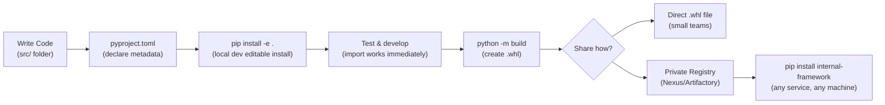
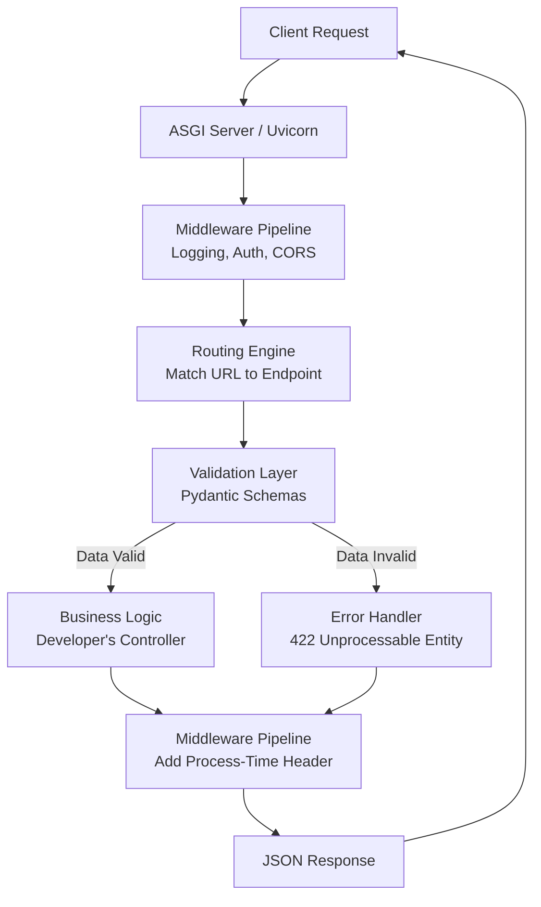

# Python Framework Building & Library Development Interview Guide

## Resume Statement
*Built an internal Python utility framework for reusable API components including middleware, logging, validation, and configuration management.*

---

## How to Explain This Project

### Short Version (The "Elevator Pitch")
"In my previous role, I noticed our team was copying and pasting the same boilerplate code—like logging setup, request validation, and auth middleware—across multiple microservices. To solve this, I designed and built an internal reusable Python package. It standardized our middleware, validation, logging, and configuration management. This drastically reduced duplicated backend code, ensured consistency across our services, and significantly sped up the onboarding process for new developers."

---

## Architecture

This is the standard layout of the internal framework repository:

```text
internal_framework/
├── src/
│   └── internal_framework/
│       ├── middleware/
│       │   ├── logging.py
│       │   ├── auth.py
│       │   └── request_id.py
│       ├── validation/
│       │   └── validators.py
│       ├── config/
│       │   └── settings.py
│       ├── logger/
│       │   └── logger.py
│       ├── utils/
│       │   └── exceptions.py
│       └── __init__.py
├── tests/
├── pyproject.toml
└── README.md
```

---

## How to Build, Install, and Use the Framework

> You do NOT need to publish to PyPI to use it. You can install it locally first, test it, then publish.

### Step 1 — Write `pyproject.toml`

This file is the heart of your package. Create it at the root of your project:

```toml
# pyproject.toml
[build-system]
requires = ["hatchling"]
build-backend = "hatchling.build"

[project]
name = "internal-framework"
version = "1.0.0"
description = "Internal reusable API framework"
requires-python = ">=3.9"
dependencies = [
    "fastapi>=0.100",
    "pydantic>=2.0",
    "pydantic-settings>=2.0",
]
```

---

### Step 2 — Install It Locally (Editable Mode)

During development, you don't need to build a `.whl` file every time you make a change. Use **editable install** (`-e`). This installs the package but points directly to your source folder — so any code changes you make are reflected immediately.

```bash
# Navigate to the root of your framework project
cd internal_framework/

# Install in editable mode — like a "live link" to your source code
pip install -e .
```

**What happens:**
- Python registers `internal-framework` as an installed package.
- But instead of copying files, it creates a pointer to your `src/` folder.
- You can now `import internal_framework` from anywhere in your Python environment.

```python
# This now works in any project in the same environment!
from internal_framework.middleware.auth import AuthMiddleware
from internal_framework.config.settings import Settings
```

---

### Step 3 — Use It in Another Project (Local Dev)

In the consuming service (e.g., `billing-api`), just import it directly:

```python
# billing-api/main.py
from fastapi import FastAPI
from internal_framework.middleware.logging import LoggingMiddleware
from internal_framework.config.settings import Settings
from internal_framework.logger.logger import get_logger

config = Settings()
logger = get_logger(__name__)

app = FastAPI()
app.add_middleware(LoggingMiddleware)

@app.get("/health")
def health():
    logger.info("Health check called")
    return {"status": "ok"}
```

---

### Step 4 — Build a Distributable Package (When Ready to Share)

Once development is done and you want to share it with other teams, build a `.whl` (wheel) file:

```bash
# Install the build tool first
pip install build

# Build the package — creates dist/ folder with .whl and .tar.gz
python -m build
```

This creates:
```text
dist/
├── internal_framework-1.0.0-py3-none-any.whl   ← The installable binary
└── internal_framework-1.0.0.tar.gz              ← The source archive
```

---

### Step 5A — Share via File (Quick & Simple)

Teams can install directly from the `.whl` file:

```bash
pip install dist/internal_framework-1.0.0-py3-none-any.whl
```

---

### Step 5B — Publish to a Private Registry (Production Approach)

For teams distributed across services, publish to a private package index:

```bash
# Install twine (the upload tool)
pip install twine

# Upload to your private registry (Nexus, Artifactory, or AWS CodeArtifact)
twine upload --repository-url https://my-private-registry/simple/ dist/*
```

Teams then install it like any other package:

```bash
pip install internal-framework --index-url https://my-private-registry/simple/
```

Or pin the version in their `requirements.txt`:

```text
# billing-api/requirements.txt
internal-framework==1.0.0
fastapi==0.110.0
uvicorn==0.29.0
```

---

### Full Workflow Summary



---

## ⚡ Cross Questions — Brutal Interviewer Follow-ups

These are the follow-up questions interviewers ask immediately after your initial answer. They are designed to catch candidates who memorized answers but never actually built anything.

---

### After you say: "I built a reusable Python framework..."

| Cross Question | What to Say |
|---|---|
| **Why a framework and not just a shared utility file?** | "A single file doesn't enforce structure. A package with proper versioning, tests, and a `pyproject.toml` allows teams to pin a specific version, see a changelog, and not be surprised by breaking changes." |
| **Who were the consumers of this framework?** | "Other backend microservice teams. We had 3 teams onboarded, each running 2-4 FastAPI services. The framework was their starting template." |
| **Did you get pushback? How did you handle it?** | "Yes. The main resistance was 'another thing to maintain.' I addressed it by starting with the logging module only, which had zero risk and immediate value. Once teams saw the benefit, buy-in grew." |
| **What would you do differently if you rebuilt it today?** | "I'd invest more in automated API contract tests from day one, and establish the deprecation policy before the first release — not after the first breaking change." |

---

### After you explain the Folder Structure

| Cross Question | What to Say |
|---|---|
| **Why `src/` layout instead of flat layout?** | "The `src/` layout prevents accidentally importing the local uninstalled package during tests. Without it, `import internal_framework` during tests might load the raw source folder instead of the installed wheel, masking packaging bugs." |
| **Why is `pyproject.toml` there instead of `setup.py`?** | "`setup.py` is the legacy approach. `pyproject.toml` is the modern PEP 517/518 standard. It supports build backends like `hatchling` or `flit` and works natively with `pip` and `poetry`." |
| **What is in `__init__.py`?** | "It controls the public API of the package. I explicitly re-exported only what external teams should use: `from internal_framework import setup_app, CoreMiddleware, Settings`. Internals stay hidden." |
| **Why separate `logger/` and `middleware/`? Couldn't logging just be in middleware?** | "Separation of concerns. The `logger/` module is a standalone utility that any part of the system (including non-middleware code like background tasks) can import. Middleware is specifically about HTTP request/response interception." |
| **How do you handle circular imports across these modules?** | "By keeping the dependency direction strict: `utils` has no internal imports. `config` imports only `utils`. `logger` imports `config`. `middleware` imports `logger` and `config`. Never the reverse." |

---

### After you explain Middleware

| Cross Question | What to Say |
|---|---|
| **What happens if your middleware crashes? Does it take down the whole app?** | "No. The middleware wraps the `call_next()` in a `try/except`. If the middleware itself fails, it catches the exception, logs it, and returns a `500` response rather than propagating the crash." |
| **How did you test the middleware in isolation?** | "Using `httpx.AsyncClient` with `app=my_app` to make real in-process HTTP requests without a live server. I also directly unit-tested the `dispatch()` method by mocking the `request` and `call_next` objects." |
| **Why not use a decorator on every route instead of middleware?** | "Decorators must be manually added to every endpoint. One developer forgets it once and you have an untracked request. Middleware is registered once and is guaranteed to intercept 100% of traffic." |
| **How do you allow teams to opt-out of specific middleware?** | "I designed the middleware as optional components registered during `setup_app()`. Teams pass in a list of what they want: `setup_app(middlewares=[AuthMiddleware, LoggingMiddleware])`. Omit it from the list to skip it." |

---

### After you explain Logging

| Cross Question | What to Say |
|---|---|
| **How do correlation IDs flow across multiple microservices?** | "The first service generates a UUID and sets it as the `X-Request-ID` header. Every subsequent downstream service reads that header and injects it into its own logs. A centralized log aggregator (Datadog) can then filter by that single ID to see the entire request chain." |
| **How do you avoid logging sensitive data like passwords?** | "The logger module has a `SENSITIVE_KEYS` blocklist. Before serializing any request body or headers to JSON logs, it iterates through and replaces values of keys like `password`, `token`, `credit_card` with `***REDACTED***`." |
| **What log level do you use in production?** | "`WARNING` and above in production. `DEBUG` level logs every request body and is too noisy and expensive in prod. It is enabled per-service via an environment variable for temporary debugging sessions only." |

---

### After you explain Configuration

| Cross Question | What to Say |
|---|---|
| **What happens if a required environment variable is missing when the app boots?** | "With `pydantic-settings`, the app immediately raises a `ValidationError` and crashes at startup — before it ever starts accepting traffic. This is the correct behaviour. It's far better to crash on boot than to fail silently mid-request when a variable is first accessed." |
| **How do you manage secrets in production — are they in the `.env` file?** | "Never. `.env` files are for local development only and are in `.gitignore`. In production, secrets are injected by the deployment platform — Kubernetes Secrets, AWS Secrets Manager, or HashiCorp Vault — as OS environment variables." |
| **Can two services use different configs from the same framework?** | "Yes. Each service creates its own `Settings` subclass, inheriting all the base framework config fields and adding its own service-specific ones. The framework provides a `BaseSettings` class; services extend it." |

---

## Component Explanations

### 1. Middleware

**Purpose:**
* **Request Interception:** Capturing traffic before it hits the endpoint.
* **Logging:** Recording response times and HTTP status codes.
* **Error Handling:** Catching unhandled exceptions and returning standard JSON error responses.
* **Request Tracking:** Injecting correlation IDs into headers for distributed tracing.

**Example Implementation:**
```python
import time
from fastapi import Request
from starlette.middleware.base import BaseHTTPMiddleware

class CoreMiddleware(BaseHTTPMiddleware):
    async def dispatch(self, request: Request, call_next):
        start_time = time.time()
        # Pre-processing (e.g., injecting a correlation ID)
        request.state.correlation_id = request.headers.get("X-Request-ID", "generated-id")
        
        # Pass control to the endpoint
        response = await call_next(request)
        
        # Post-processing
        process_time = time.time() - start_time
        response.headers["X-Process-Time"] = str(process_time)
        return response
```

**Interview Question: Why use middleware instead of decorators?**
**Answer:** Middleware provides centralized, global processing. Decorators must be manually applied to every single endpoint, which leads to human error (developers forgetting to add them). Middleware guarantees that the logic (like tracing or CORS) is executed across *all* endpoints consistently.

---

### 2. Logging

**Purpose:**
* Standardized log formats (JSON logs for ELK/Datadog).
* Consistent Correlation IDs to trace a request through multiple microservices.
* Centralized debugging.

**Format (JSON Example):**
```json
{
  "timestamp": "2023-10-27T10:00:00Z",
  "request_id": "req-12345",
  "service": "billing-api",
  "level": "INFO",
  "message": "Payment processed successfully"
}
```

**Interview Questions:**
* **Why not just use `print()`?** `print()` blocks the thread, isn't thread-safe, has no severity levels (INFO, ERROR), and cannot easily pipe structured JSON to log aggregators.
* **How do logs scale across services?** By using structured JSON logging and injecting correlation IDs. A central aggregator (like Datadog or Splunk) ingests these logs, allowing us to search for a specific `request_id` and trace it across the entire microservice ecosystem.

**Answer Summary:** Centralized, structured logs transform debugging from a guessing game into a predictable, searchable process.

---

### 3. Validation

**Purpose:**
* **Input Validation:** Ensuring types and basic constraints (e.g., email format, integer ranges).
* **Business Rule Validation:** Abstracting common rules out of the business logic layer.

**Interview Questions:**
* **Pydantic vs Custom Validation?** Pydantic is superior because it combines type parsing (casting strings to ints) with validation. It's heavily optimized (written in Rust in V2) and auto-generates JSON schemas.
* **Why not validate inside the endpoint?** Separation of concerns. Schema/type validation belongs at the framework level (so the endpoint only executes if data is valid). Business validation (e.g., "does this user have sufficient balance?") belongs in the service layer.

---

### 4. Configuration Management

**Purpose:**
* Strict environment separation (Dev, Staging, Prod).
* Avoiding hardcoded secrets in the codebase.

**Example Implementation:**
```python
from pydantic_settings import BaseSettings

class Settings(BaseSettings):
    DATABASE_URL: str
    SECRET_KEY: str
    DEBUG: bool = False

    class Config:
        env_file = ".env"

config = Settings()
```

**Interview Questions:**
* **Why not use `os.getenv()` everywhere?** Using `os.getenv()` scatters configuration logic throughout the codebase. It doesn't validate types (everything is a string) and doesn't crash on startup if a crucial variable is missing. A centralized settings class validates config *before* the app boots.
* **Secret management?** Secrets should never be committed. They are injected at runtime via Environment Variables via AWS Secrets Manager, HashiCorp Vault, or Kubernetes Secrets.

---

## Deep Dive Interview Question

### "How do you design a framework from scratch?"

**Answer:** Designing a framework is an 8-step process.

#### Step 1. Define the Problem
First, I ask: What repeats? Who uses it? If multiple teams are writing the same Logging, Validation, Auth, and Routing boilerplate, that code should be abstracted into a framework.

#### Step 2. Build the Architecture
I lay out the Core Architecture, which typically consists of:
* Router
* Middleware Pipeline
* Validation Layer
* Logging Subsystem
* Config Manager
* Extension APIs (Plugins)

#### Step 3. Define the Request Lifecycle
I map exactly how data flows through the system. A visual representation of the framework's code workflow:



#### Step 4. Extension Design
A framework must be extensible without requiring users to modify the source code. I support this via:
* Hooks / Events
* Plugins
* Middleware Injection
* Dependency Injection

*Example:* `framework.register_plugin(AuthPlugin())`
*Why plugins?* It adheres to the Open/Closed principle. Users can extend the framework's behavior (Open for extension) without changing its core source code (Closed for modification).

#### Step 5. Configuration Strategy
The framework must adapt to different environments.
*Example:* `app = Framework(debug=True)`
*Environment Handling:* Variables flow from `Env Variables → Config Class → Runtime Settings`.

#### Step 6. Centralized Error Handling
Mapping unhandled exceptions to standardized HTTP responses.
`Try/Catch → Log Error → Transform to standard JSON schema → Return Response`
*Why centralized?* To guarantee consistency. The frontend team needs to know that a 400 Bad Request always looks exactly the same, no matter which endpoint threw the error.

#### Step 7. Testing Strategy
A framework needs rigorous testing:
* **Unit:** Testing individual utils.
* **Integration:** Testing how middleware interacts with routing.
* **Contract:** Ensuring API schemas don't break.
* **Compatibility:** Testing across different Python versions.
*How do you avoid breaking users?* Strict adherence to Semantic Versioning (`MAJOR.MINOR.PATCH`) and long deprecation cycles.

#### Step 8. Performance Optimizations
* **Lazy Loading:** Only importing heavy modules when needed.
* **Async:** Native support for `asyncio` to handle high I/O concurrency.
* **Pooling:** Connection pooling for databases to avoid TCP handshake overhead.

---

## Dangerous Follow-up Questions

### Q. Framework vs Library?
**Answer:** A library is called by the user. A framework calls the user's code (Inversion of Control). With a library, the developer dictates the flow. With a framework, the framework controls the execution flow and execution environment.

### Q. How did users actually integrate your framework?
**Answer:** I designed it to wrap around existing microservices smoothly. Usually, it involved importing a single setup function that bootstrapped the app:
```python
from internal_framework import setup_app
from my_service.routes import router

app = setup_app(
    service_name="billing-api",
    routers=[router]
)
```

### Q. How was versioning handled?
**Answer:** We used strict Semantic Versioning (`MAJOR.MINOR.PATCH`). Bug fixes bumped the patch version, new backward-compatible features (like a new logging hook) bumped the minor version, and breaking changes (changing a middleware signature) required a major version bump and a migration guide.

### Q. What was the biggest challenge?
**Answer:** Backward compatibility and adoption. When you own the core framework, a single bug or breaking change can break 10 different microservices downstream. I had to implement extensive regression testing and clearly communicate updates to other teams.

### Q. How did you measure success?
**Answer:** By lines of duplicated code deleted across microservices, and by measuring the time it took for a new developer to spin up a production-ready API (which dropped from days to mere hours).

---

## Test Automation Framework Specifics

If your framework focuses on Test Automation (e.g., QA, Selenium, API testing), be prepared for these specific questions:

### Q. Why did you build reusable libraries?
**Answer:** To adhere to the DRY (Don't Repeat Yourself) principle. Without reusable libraries, QA engineers end up rewriting the same API requests or Selenium locators across hundreds of tests. Reusable libraries abstract away the complex underlying tool (like Selenium WebDriver or `requests`) into simple, domain-specific business functions (e.g., `login_user()`, `create_order()`).

### Q. Explain the folder structure of your test framework.
**Answer:** A scalable test framework separates test intent from test implementation:
```text
tests/
├── conftest.py          # Global pytest fixtures and hooks
├── pages/               # Page Object Model (POM) classes (UI locators & actions)
├── api_clients/         # Wrappers around external APIs
├── config/              # Test environment configs (URLs, credentials)
├── data/                # Test data (JSON, CSV for data-driven testing)
└── specs/               # The actual test files (test_login.py)
```

### Q. What is a Keyword-Driven Framework?
**Answer:** It's an approach where test cases are written using predefined "keywords" (like `Click Button`, `Enter Text`, `Verify Title`) rather than raw code. Frameworks like Robot Framework use this.
*   **Pros:** Non-technical domain experts (BAs, Product Managers) can write and read tests easily.
*   **Cons:** High maintenance overhead for developers to map keywords to actual Python code under the hood.

### Q. Why use the Page Object Model (POM)?
**Answer:** POM is a design pattern that creates an object repository for web UI elements. Instead of having CSS/XPath locators scattered across 50 test files, you store them in one `LoginPage` class. If the UI changes, you update the locator in exactly *one* place, and all 50 tests instantly use the fixed locator. It drastically reduces maintenance.

**Example (Pytest + Selenium POM):**
```python
# pages/login_page.py
from selenium.webdriver.common.by import By

class LoginPage:
    def __init__(self, driver):
        self.driver = driver
        # Locators are defined in ONE place
        self.username_input = (By.ID, "user-name")
        self.password_input = (By.ID, "password")
        self.login_button = (By.ID, "login-button")

    def login(self, username, password):
        self.driver.find_element(*self.username_input).send_keys(username)
        self.driver.find_element(*self.password_input).send_keys(password)
        self.driver.find_element(*self.login_button).click()

# specs/test_login.py
import pytest
from pages.login_page import LoginPage

# 'browser' is a Pytest fixture yielding a Selenium WebDriver
def test_successful_login(browser):
    browser.get("https://example.com/login")
    login_page = LoginPage(browser)
    
    # Notice how clean the test is! No locators or raw selenium calls here.
    login_page.login("standard_user", "secret_sauce")
    
    assert "dashboard" in browser.current_url
```

### Q. How was configuration loaded?
**Answer:** We used environment variables alongside a config parser (like `pydantic_settings` or `Dynaconf`). For local testing, a `.env` file was loaded. For CI/CD, the pipeline injected variables directly. This allowed us to run the exact same test suite against `dev`, `staging`, and `production` simply by changing the `ENV` variable, without altering any test code.

### Q. How did logging work in the test framework?
**Answer:** We configured Python's native `logging` module to output two streams:
1.  **Console (stdout):** High-level INFO logs for the developer watching the run locally.
2.  **File (`test_run.log`):** Deep DEBUG logs containing full HTTP request payloads, response bodies, and stack traces. This file was attached as an artifact in CI/CD if a test failed, making debugging async failures much easier.

### Q. How did you reduce duplication?
**Answer:** 
1.  Abstracting common workflows into base classes or utility functions.
2.  Using Pytest `fixtures` extensively to handle test setup and teardown automatically.
3.  Utilizing `@pytest.mark.parametrize` to run the same logical test against a matrix of different data inputs, rather than copying and pasting the test function 10 times.

### Q. PyTest `fixture` vs standard `setUp()`?
**Answer:** The old `unittest` module uses `setUp()` and `tearDown()`, which forces you into a rigid Object-Oriented inheritance structure. PyTest fixtures are functional, modular, and composable. A test can request exactly the fixtures it needs (e.g., `def test_cart(browser, auth_token, db_session):`) without inheriting from a massive, slow `BaseTestClass` that sets up things the specific test might not even use.

### Q. How were tests executed in CI/CD?
**Answer:** We integrated with GitHub Actions (or Jenkins/GitLab CI). 
1.  A developer opens a Pull Request.
2.  The CI pipeline spins up a Docker container.
3.  It installs dependencies via `poetry install` or `pip install`.
4.  It runs the suite: `pytest -n auto --html=report.html`.
5.  If tests pass, the PR can be merged. If they fail, the HTML report and logs are uploaded as pipeline artifacts.

### Q. How would you scale to 10k tests?
**Answer:** Scaling requires heavy parallelization and optimization:
1.  **Parallel Execution:** Use `pytest-xdist` to run tests across multiple CPU cores (`pytest -n 8`).
2.  **Distributed Execution:** Run shards of tests across multiple CI runners/nodes simultaneously.
3.  **State Management:** Stop doing slow UI logins. Inject auth cookies/tokens directly via API to bypass UI steps.
4.  **Database Isolation:** Isolate test data. Spin up lightweight Docker databases per worker, or use transactional rollbacks so concurrent tests don't corrupt each other's state.

### Q. How do you handle dynamic or slow-loading elements in Selenium?
**Answer:** Never use `time.sleep()`. It makes tests incredibly slow and flaky. Instead, use **Explicit Waits** (`WebDriverWait` combined with `expected_conditions`). This tells Selenium to pause *up to* a maximum amount of time, but to proceed immediately the millisecond the condition (like `element_to_be_clickable`) is met.
*(Note: Implicit waits apply globally to all `find_element` calls, but mixing Implicit and Explicit waits in the same framework is a known anti-pattern that causes unpredictable timeouts).*

### Q. How do you manage WebDriver initialization in Pytest?
**Answer:** I use a Pytest fixture in `conftest.py` with `yield`. This ensures the browser opens before the test and safely closes after the test, even if the test crashes.
```python
@pytest.fixture
def browser():
    driver = webdriver.Chrome()
    driver.maximize_window()
    yield driver  # Test runs here
    driver.quit() # Teardown executes after the test
```

### Q. How do you debug Selenium tests that fail in CI/CD?
**Answer:** I implement a custom Pytest hook (`pytest_runtest_makereport`) in `conftest.py`. If a test fails, the hook catches the exception and automatically triggers `driver.save_screenshot('error.png')`. It also dumps the DOM's raw HTML and the browser console logs into an artifact folder, which is then uploaded to Jenkins/GitHub Actions.

### Q. How do you handle iFrames or Alerts in Selenium?
**Answer:** 
*   **iFrames:** Selenium cannot interact with elements inside an iFrame by default. You must explicitly switch context using `driver.switch_to.frame("iframe_id")`. To go back to the main page, use `driver.switch_to.default_content()`.
*   **Alerts:** You switch to the alert context using `alert = driver.switch_to.alert`, then you can call `alert.accept()` or `alert.dismiss()`.

---

## Even More Advanced Pytest & Selenium Questions

### Q. What is a `StaleElementReferenceException` and how do you fix it?
**Answer:** This happens when you find an element, but before you can click it, the page refreshes or JavaScript modifies the DOM, destroying the original element. 
**Fix:** The only reliable fix is to re-find the element right before interacting with it, or wrap your interactions in a `try/except` block and use a loop to retry finding the element if a `StaleElementReferenceException` is caught.

### Q. Why and how do you execute JavaScript directly via Selenium?
**Answer:** Sometimes Selenium's `.click()` fails because an element is hidden behind a sticky header, or you need to scroll precisely. 
You use `driver.execute_script("arguments[0].click();", element)`. This bypasses the WebDriver's "interactability" checks and executes the click directly in the browser DOM. Another common use case is scrolling: `driver.execute_script("window.scrollTo(0, document.body.scrollHeight);")`.

### Q. What is Headless mode? How do you run tests headlessly?
**Answer:** Headless mode runs the browser in the background without rendering a visual UI, making tests run significantly faster and allowing them to run on Linux CI/CD servers that don't have a monitor/display.
In Python:
```python
from selenium.webdriver.chrome.options import Options
options = Options()
options.add_argument('--headless=new')
options.add_argument('--disable-gpu') # often needed for older headless versions
driver = webdriver.Chrome(options=options)
```

### Q. What are Pytest Hooks? Give an example.
**Answer:** Hooks allow you to inject custom logic into Pytest's internal execution lifecycle. They are defined in `conftest.py`.
*   `pytest_sessionstart(session)`: Runs exactly once before any tests begin (great for setting up global DB pools).
*   `pytest_runtest_setup(item)`: Runs right before a specific test starts.
*   `pytest_runtest_makereport(item, call)`: Runs when a test finishes, used to check if the test failed so you can take a screenshot or update a test management tool (like Jira/Xray).

### Q. How do you handle flaky tests?
**Answer:** Flaky tests (pass sometimes, fail sometimes) ruin CI/CD trust. 
1.  **Immediate Fix:** Use a plugin like `pytest-rerunfailures` (`pytest --reruns 3`). If the test fails, it immediately tries again up to 3 times before marking it as a true failure.
2.  **Long-Term Fix:** Identify the root cause. It's almost always a `time.sleep()` issue (replace with Explicit Waits), a lack of database isolation (data bleeding between tests), or relying on an unstable 3rd-party API.

### Q. How do you handle Shadow DOM in Selenium?
**Answer:** Standard CSS/XPath locators cannot pierce a Shadow DOM. In newer Selenium versions, you have to find the shadow host element, then use `.shadow_root` to enter it, and then search for your elements within that root. Alternatively, you can use `execute_script` to pierce the shadow root via JavaScript.

---

## Robot Framework Specific Questions

### Q. What is Robot Framework and what are its key features?
**Answer:** Robot Framework is an open-source, keyword-driven automation framework.
*   **Key Features:** It uses a tabular, plain-text syntax that is easy for non-programmers to read. It separates test data from test logic. It is highly extensible via custom Python libraries and has a massive ecosystem of built-in libraries (like `SeleniumLibrary` and `RequestsLibrary`). It generates detailed HTML reports out of the box.

### Q. What are the different file sections/tables in a Robot Framework test suite?
**Answer:** A typical `.robot` file contains four main tables:
1.  `*** Settings ***`: Imports libraries, resource files, and defines Suite Setup/Teardown.
2.  `*** Variables ***`: Defines global or suite-level variables.
3.  `*** Test Cases ***`: The actual test scenarios written using keywords.
4.  `*** Keywords ***`: Custom user-defined keywords (higher-level abstractions composed of other keywords).

### Q. How do you create custom keywords in Robot Framework using Python?
**Answer:** You write a Python class or module with methods, and then import it as a Library.
```python
# MyCustomLibrary.py
from robot.api.deco import keyword

class MyCustomLibrary:
    @keyword("Calculate Complex Discount")
    def calculate_discount(self, price, customer_type):
        if customer_type == 'VIP':
            return float(price) * 0.8
        return float(price)
```
In the `.robot` file, you import it:
```robot
*** Settings ***
Library    MyCustomLibrary.py

*** Test Cases ***
Test VIP Discount
    ${discounted_price}=    Calculate Complex Discount    100    VIP
    Should Be Equal As Numbers    ${discounted_price}    80.0
```

### Q. What are the differences between `${var}`, `@{var}`, and `&{var}`?
**Answer:** 
*   `${var}`: Scalar variable (strings, numbers, objects).
*   `@{var}`: List variable (arrays). Elements accessed via `${var}[0]`.
*   `&{var}`: Dictionary variable (key-value pairs). Elements accessed via `${var}[key]`.

### Q. How do you pass arguments from the command line when running Robot tests?
**Answer:** You use the `-v` (or `--variable`) flag. This is crucial for injecting environment variables like URLs in a CI/CD pipeline.
*Example:* `robot -v BROWSER:chrome -v ENV:staging tests/`

### Q. What is the difference between `Suite Setup` and `Test Setup`?
**Answer:** 
*   `Suite Setup` runs exactly **once** before any tests in the file execute (e.g., Opening a database connection or launching the browser).
*   `Test Setup` runs before **every single test case** in the file (e.g., navigating back to the home page and clearing cookies so tests are isolated).

---

## Robot Framework — Advanced Interview Questions

### Q. What is a Resource File in Robot Framework?
**Answer:** A Resource File (`.resource` or `.robot`) is a shared file that contains reusable keywords, variables, and library imports. It is like a shared "utility module" for Robot Framework. Any test suite can import it using `Resource    common/my_keywords.resource`, avoiding duplication across test files.

```
*** Settings ***
Resource    ../resources/common_keywords.resource

*** Test Cases ***
Login And Check Dashboard
    Open Application
    Login As Admin
    Verify Dashboard Visible
```

---

### Q. What are Test Tags and how do you use them?
**Answer:** Tags are labels applied to test cases to control which tests run in a specific pipeline run. This is critical for CI/CD.

```robot
*** Test Cases ***
Test Login Feature
    [Tags]    smoke    regression    login
    Open Browser    ${URL}    Chrome
    ...

Test Checkout Feature
    [Tags]    regression    payments
    ...
```

Run only smoke tests:
```bash
robot --include smoke tests/
```
Exclude slow tests:
```bash
robot --exclude payments tests/
```

---

### Q. How do you implement Data-Driven Testing in Robot Framework?
**Answer:** Using the `*** Test Cases ***` template syntax. You define a single keyword template and provide multiple rows of data — Robot Framework runs the test independently for each row.

```robot
*** Settings ***
Test Template    Verify Login With Credentials

*** Test Cases ***    USERNAME       PASSWORD     EXPECTED
Valid User Login      admin          secret123    Welcome
Invalid Password      admin          wrongpass    Error
Empty Username        ${EMPTY}       secret123    Error

*** Keywords ***
Verify Login With Credentials
    [Arguments]    ${username}    ${password}    ${expected_msg}
    Input Text     id=username    ${username}
    Input Text     id=password    ${password}
    Click Button   id=login-btn
    Page Should Contain    ${expected_msg}
```

---

### Q. How do you use FOR Loops and IF conditions in Robot Framework?
**Answer:**

**FOR Loop:**
```robot
*** Test Cases ***
Check All Products
    @{products}=    Create List    Apple    Banana    Mango
    FOR    ${product}    IN    @{products}
        Log    Checking product: ${product}
        Product Should Be In Stock    ${product}
    END
```

**IF Condition:**
```robot
*** Keywords ***
Apply Discount If VIP
    [Arguments]    ${customer_type}    ${price}
    IF    '${customer_type}' == 'VIP'
        ${final_price}=    Evaluate    ${price} * 0.8
    ELSE
        ${final_price}=    Set Variable    ${price}
    END
    RETURN    ${final_price}
```

---

### Q. How do you handle errors and exceptions in Robot Framework?
**Answer:**
*   **`Run Keyword And Ignore Error`**: Runs a keyword and ignores if it fails. Returns status `PASS` or `FAIL` and the error message.
*   **`Run Keyword And Expect Error`**: Asserts that a keyword **must** fail with a specific error message.
*   **`Wait Until Keyword Succeeds`**: Retries a failing keyword repeatedly for a set duration — ideal for waiting on slow elements.

```robot
*** Test Cases ***
Test Error Handling
    ${status}    ${msg}=    Run Keyword And Ignore Error    Element Should Be Visible    id=popup
    IF    '${status}' == 'PASS'
        Click Button    id=close-popup
    END

    # Retry clicking a button for up to 10 seconds, retrying every 2 seconds
    Wait Until Keyword Succeeds    10s    2s    Click Element    id=submit-btn
```

---

### Q. What is a Robot Framework Listener?
**Answer:** A Listener is a Python class that hooks into the Robot Framework execution lifecycle — similar to Pytest Hooks. You can use it to:
*   Take a screenshot automatically when any test fails.
*   Send a Slack/Teams notification on completion.
*   Update a test management tool (Jira, Xray, TestRail) in real-time.

```python
# listeners/screenshot_on_fail.py
class ScreenshotOnFail:
    ROBOT_LISTENER_API_VERSION = 2

    def end_test(self, name, attrs):
        if attrs['status'] == 'FAIL':
            from SeleniumLibrary import SeleniumLibrary
            # Take screenshot on failure
            driver = BuiltIn().get_library_instance('SeleniumLibrary').driver
            driver.save_screenshot(f"screenshots/{name}.png")
```
Run with: `robot --listener listeners/screenshot_on_fail.py tests/`

---

### Q. How do you integrate Robot Framework with Selenium (SeleniumLibrary)?
**Answer:** Import `SeleniumLibrary` and use its built-in keywords. The key keywords to know are:

| Action | Keyword |
|---|---|
| Open browser | `Open Browser    ${URL}    chrome` |
| Click an element | `Click Element    id=submit-btn` |
| Type text | `Input Text    id=username    admin` |
| Check text on page | `Page Should Contain    Welcome` |
| Wait for element | `Wait Until Element Is Visible    id=loader    timeout=10s` |
| Close browser | `Close Browser` |

---

### Q. How do you manage dynamic locators in Robot Framework?
**Answer:** By using variable substitution inside locators. This avoids having to write a separate keyword for every item in a dynamic list.

```robot
*** Variables ***
${PRODUCT_ROW}    xpath://table//tr[td[text()='{}']]/td[2]

*** Keywords ***
Get Product Price
    [Arguments]    ${product_name}
    ${locator}=    Format String    ${PRODUCT_ROW}    ${product_name}
    ${price}=    Get Text    ${locator}
    RETURN    ${price}

*** Test Cases ***
Verify Apple Price
    ${price}=    Get Product Price    Apple
    Should Be Equal    ${price}    $1.99
```

---

### Q. How do you run Robot Framework tests in CI/CD?
**Answer:** The standard CI/CD command is:
```bash
robot \
  --variable ENV:staging \
  --variable BROWSER:headlesschrome \
  --include regression \
  --outputdir results/ \
  --log log.html \
  --report report.html \
  tests/
```
The generated `report.html` is uploaded as a CI pipeline artifact so teams can review test results without accessing the server.

---

### Q. What is the difference between `Library` and `Resource` in Robot Framework?
**Answer:**
*   **`Library`**: Imports a Python-coded library (`.py` file or an installed package like `SeleniumLibrary`). Used to access code that performs actual actions (opening browsers, making API calls).
*   **`Resource`**: Imports another Robot Framework file (`.resource`). Used to share keywords and variables written in Robot Framework syntax across multiple test suites.

---

## Framework Development — Other Common Interview Questions

### Q. How do you ensure backward compatibility when updating a framework?
**Answer:** Backward compatibility is the #1 responsibility of a framework owner. My strategy:
1. **Deprecation Warnings First**: Never remove a feature immediately. Mark it deprecated with `warnings.warn()` for at least one major version cycle, printing a helpful message telling users what to use instead.
2. **Semantic Versioning**: Breaking changes only happen in MAJOR version bumps (e.g., `v1.x → v2.0`). Minor and patch releases must never break existing code.
3. **Regression Test Suite**: Every release runs the full regression suite against the API contract before publishing to PyPI.
4. **Migration Guides**: Publish a `CHANGELOG.md` and a migration guide for any MAJOR version bump.

```python
import warnings

def old_function():
    warnings.warn(
        "old_function() is deprecated and will be removed in v3.0. "
        "Use new_function() instead.",
        DeprecationWarning,
        stacklevel=2
    )
    return new_function()
```

---

### Q. How do you package and distribute a Python framework internally?
**Answer:** I use a private package registry. The process is:
1. Define the package metadata in `pyproject.toml` (name, version, dependencies, entry points).
2. Build the distribution: `python -m build` → creates `.whl` and `.tar.gz` files.
3. Push to a private registry: internal Nexus, Artifactory, or AWS CodeArtifact.
4. Teams install it: `pip install internal-framework --index-url https://my-private-registry/simple/`.

---

### Q. How do you handle dependency conflicts between the framework and user projects?
**Answer:** I declare **minimum** version requirements in `pyproject.toml`, not pinned exact versions. For example:
```toml
[project]
dependencies = [
    "pydantic>=2.0,<3.0",  # Pinning major version avoids breaking changes
    "httpx>=0.24",          # Minimum version needed for a specific feature
]
```
Using broad version ranges allows the framework to coexist with other libraries that the user's app depends on. I also regularly run dependency audits using `pip-audit` to check for security vulnerabilities.

---

### Q. How do you design a plugin or extension system?
**Answer:** I follow the **Open/Closed principle** — the framework core is closed for modification but open for extension. The pattern is:
1. Define an **abstract base class (interface)** that plugins must implement.
2. The framework has a **plugin registry** (a dictionary).
3. Users register their plugin instance with the framework.
4. The framework calls plugin lifecycle hooks at the right moments.

```python
from abc import ABC, abstractmethod

class BasePlugin(ABC):
    @abstractmethod
    def on_request(self, request): ...

    @abstractmethod
    def on_response(self, response): ...

class Framework:
    def __init__(self):
        self._plugins: list[BasePlugin] = []

    def register_plugin(self, plugin: BasePlugin):
        self._plugins.append(plugin)

    def process_request(self, request):
        for plugin in self._plugins:
            plugin.on_request(request)  # Framework calls your code
```

---

### Q. How did you handle configuration across different environments (dev, staging, prod)?
**Answer:** I used a layered configuration approach with `pydantic-settings`:
- **Layer 1 (Defaults)**: Safe default values hardcoded in the Settings class.
- **Layer 2 (`.env` file)**: Overrides defaults for local development.
- **Layer 3 (OS Environment Variables)**: CI/CD pipeline injects prod secrets. This layer always wins.

This means the same codebase, zero changes, runs correctly in all environments. The framework validates all settings at startup and raises a `ValidationError` immediately if a required variable is missing.

---

### Q. How do you write tests for the framework itself?
**Answer:** Testing a framework is different from testing a business application — you are testing the framework's contract:
1. **Unit Tests**: Test individual utilities like the config parser or the routing regex logic in isolation.
2. **Integration Tests**: Spin up a real test server using `httpx.AsyncClient` and make real HTTP requests against a minimal test app built on the framework.
3. **Contract Tests**: Assert that the public API (function signatures, response schemas) does not change between versions.
4. **Compatibility Matrix**: Use `tox` to run the test suite against multiple Python versions (3.9, 3.10, 3.11, 3.12) and multiple OS environments in CI.

```python
# Example integration test using httpx + pytest
import pytest
from httpx import AsyncClient
from my_framework import create_app

@pytest.mark.asyncio
async def test_health_endpoint():
    app = create_app()
    async with AsyncClient(app=app, base_url="http://test") as client:
        response = await client.get("/health")
    assert response.status_code == 200
    assert response.json() == {"status": "ok"}
```

---

### Q. How do you handle security concerns in a shared framework?
**Answer:**
- **Secrets Management**: Never allow secrets to be passed as constructor arguments. Force them through environment variables only.
- **Input Sanitization**: The validation layer must sanitize and reject malformed inputs (SQL injection, XSS payloads) before they reach business logic.
- **Dependency Auditing**: Regularly run `pip-audit` or use GitHub Dependabot to catch vulnerable transitive dependencies.
- **Rate Limiting Middleware**: Provide an optional rate-limiting middleware so teams don't need to build one themselves.
- **HTTPS Enforcement**: Middleware that redirects HTTP → HTTPS in production.

---

### Q. How do you handle async vs sync in a shared framework?
**Answer:** A modern framework must support both. The pattern is to offer both sync and async versions of core operations, or to use `asyncio.run()` as a bridge. For example, SQLAlchemy offers both `Session` (sync) and `AsyncSession` (async).

The key rule: **never block the async event loop with sync I/O**. If a user calls a slow database function synchronously inside an async endpoint, it will freeze the entire server. I document this clearly and provide async-native implementations for all I/O operations (HTTP clients, database drivers, cache clients).

---

### Q. What is Dependency Injection and how did you implement it?
**Answer:** Dependency Injection (DI) means that a function does not create the objects it needs — they are *injected* (passed in) by an external system. This makes code testable and decoupled.

FastAPI does this natively with `Depends()`. For an internal framework, I implemented a lightweight DI container:

```python
# The framework provides a container
container = {}

def provide(name, factory):
    """Register a factory function for a dependency."""
    container[name] = factory

def inject(name):
    """Retrieve and instantiate a registered dependency."""
    return container[name]()

# Application code registers dependencies
provide("db", lambda: DatabaseConnection(url=config.DATABASE_URL))

# Framework injects them into route handlers automatically
def get_user_handler(request):
    db = inject("db")   # Framework calls this; dev doesn't manually create DB connections
    return db.query(User).all()
```

---

### Q. What design patterns did you use when building the framework?
**Answer:**

| Pattern | Where Used |
|---|---|
| **Template Method** | Base middleware class defines `dispatch()` lifecycle; subclasses fill in the logic |
| **Chain of Responsibility** | Middleware pipeline — each middleware passes to the next via `call_next()` |
| **Strategy** | Pluggable authentication backends (JWT vs API Key vs OAuth) |
| **Singleton** | Config object loaded once and shared globally |
| **Observer** | Event/hook system — plugins subscribe to events like `on_request_start` |
| **Factory** | `create_app()` function that wires all components together |

---

### Q. How did you get other teams to adopt the internal framework?
**Answer:** Adoption is a social and documentation problem, not a technical one.
1. **Documentation First**: Wrote a clear README with a 5-minute "Getting Started" guide. If a developer cannot integrate it in 5 minutes, nobody will use it.
2. **Provided Migration Scripts**: For existing services, provided a script that auto-generated the framework configuration based on their existing `settings.py`.
3. **Low Risk First**: Convinced one team to adopt just the logging module first (lowest risk), not the entire framework.
4. **Internal Champions**: Found one enthusiastic developer on each team and made them the "champion." They helped their teammates when issues arose.
5. **SLA Commitment**: Committed to a 24-hour SLA to fix any critical bugs that blocked teams using the framework.

---

### Q. How do you measure the quality and performance of a framework?
**Answer:**
- **Performance Benchmarks**: Using `locust` or `wrk` to run load tests and measure requests/second and p99 latency.
- **Code Coverage**: Maintaining >90% test coverage using `pytest-cov`.
- **Import Time**: Measuring how long the framework takes to import (`python -c "import time; t=time.time(); import my_framework; print(time.time()-t)"`). A slow import hurts startup time in serverless/Lambda environments.
- **Bundle Size**: Keeping dependencies minimal to reduce installation time and Docker image sizes.
- **Developer Satisfaction**: Quarterly survey to teams using the framework asking "How easy was it to debug an issue?" and "Would you recommend it?"

---

## Strong Closing Statement

*"A well-designed framework should strike a balance: it must rigidly standardize common workflows like logging and error handling to ensure organizational consistency, but it must remain highly flexible and extensible through plugins, dependency injection, and middleware so it doesn't block developers from solving unique business problems."*
