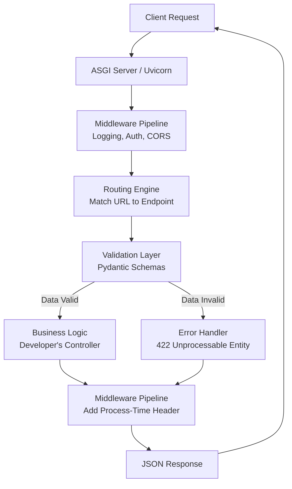

# Python Framework Building & Library Development Interview Guide

## Resume Statement
*Built an internal Python utility framework for reusable API components including middleware, logging, validation, and configuration management.*

---

## How to Explain This Project

### Short Version (The "Elevator Pitch")
"In my previous role, I noticed our team was copying and pasting the same boilerplate code—like logging setup, request validation, and auth middleware—across multiple microservices. To solve this, I designed and built an internal reusable Python package. It standardized our middleware, validation, logging, and configuration management. This drastically reduced duplicated backend code, ensured consistency across our services, and significantly sped up the onboarding process for new developers."

---

## Architecture

This is the standard layout of the internal framework repository:

```text
internal_framework/
├── src/
│   └── internal_framework/
│       ├── middleware/
│       │   ├── logging.py
│       │   ├── auth.py
│       │   └── request_id.py
│       ├── validation/
│       │   └── validators.py
│       ├── config/
│       │   └── settings.py
│       ├── logger/
│       │   └── logger.py
│       ├── utils/
│       │   └── exceptions.py
│       └── __init__.py
├── tests/
├── pyproject.toml
└── README.md
```

---

## Component Explanations

### 1. Middleware

**Purpose:**
* **Request Interception:** Capturing traffic before it hits the endpoint.
* **Logging:** Recording response times and HTTP status codes.
* **Error Handling:** Catching unhandled exceptions and returning standard JSON error responses.
* **Request Tracking:** Injecting correlation IDs into headers for distributed tracing.

**Example Implementation:**
```python
import time
from fastapi import Request
from starlette.middleware.base import BaseHTTPMiddleware

class CoreMiddleware(BaseHTTPMiddleware):
    async def dispatch(self, request: Request, call_next):
        start_time = time.time()
        # Pre-processing (e.g., injecting a correlation ID)
        request.state.correlation_id = request.headers.get("X-Request-ID", "generated-id")
        
        # Pass control to the endpoint
        response = await call_next(request)
        
        # Post-processing
        process_time = time.time() - start_time
        response.headers["X-Process-Time"] = str(process_time)
        return response
```

**Interview Question: Why use middleware instead of decorators?**
**Answer:** Middleware provides centralized, global processing. Decorators must be manually applied to every single endpoint, which leads to human error (developers forgetting to add them). Middleware guarantees that the logic (like tracing or CORS) is executed across *all* endpoints consistently.

---

### 2. Logging

**Purpose:**
* Standardized log formats (JSON logs for ELK/Datadog).
* Consistent Correlation IDs to trace a request through multiple microservices.
* Centralized debugging.

**Format (JSON Example):**
```json
{
  "timestamp": "2023-10-27T10:00:00Z",
  "request_id": "req-12345",
  "service": "billing-api",
  "level": "INFO",
  "message": "Payment processed successfully"
}
```

**Interview Questions:**
* **Why not just use `print()`?** `print()` blocks the thread, isn't thread-safe, has no severity levels (INFO, ERROR), and cannot easily pipe structured JSON to log aggregators.
* **How do logs scale across services?** By using structured JSON logging and injecting correlation IDs. A central aggregator (like Datadog or Splunk) ingests these logs, allowing us to search for a specific `request_id` and trace it across the entire microservice ecosystem.

**Answer Summary:** Centralized, structured logs transform debugging from a guessing game into a predictable, searchable process.

---

### 3. Validation

**Purpose:**
* **Input Validation:** Ensuring types and basic constraints (e.g., email format, integer ranges).
* **Business Rule Validation:** Abstracting common rules out of the business logic layer.

**Interview Questions:**
* **Pydantic vs Custom Validation?** Pydantic is superior because it combines type parsing (casting strings to ints) with validation. It's heavily optimized (written in Rust in V2) and auto-generates JSON schemas.
* **Why not validate inside the endpoint?** Separation of concerns. Schema/type validation belongs at the framework level (so the endpoint only executes if data is valid). Business validation (e.g., "does this user have sufficient balance?") belongs in the service layer.

---

### 4. Configuration Management

**Purpose:**
* Strict environment separation (Dev, Staging, Prod).
* Avoiding hardcoded secrets in the codebase.

**Example Implementation:**
```python
from pydantic_settings import BaseSettings

class Settings(BaseSettings):
    DATABASE_URL: str
    SECRET_KEY: str
    DEBUG: bool = False

    class Config:
        env_file = ".env"

config = Settings()
```

**Interview Questions:**
* **Why not use `os.getenv()` everywhere?** Using `os.getenv()` scatters configuration logic throughout the codebase. It doesn't validate types (everything is a string) and doesn't crash on startup if a crucial variable is missing. A centralized settings class validates config *before* the app boots.
* **Secret management?** Secrets should never be committed. They are injected at runtime via Environment Variables via AWS Secrets Manager, HashiCorp Vault, or Kubernetes Secrets.

---

## Deep Dive Interview Question

### "How do you design a framework from scratch?"

**Answer:** Designing a framework is an 8-step process.

#### Step 1. Define the Problem
First, I ask: What repeats? Who uses it? If multiple teams are writing the same Logging, Validation, Auth, and Routing boilerplate, that code should be abstracted into a framework.

#### Step 2. Build the Architecture
I lay out the Core Architecture, which typically consists of:
* Router
* Middleware Pipeline
* Validation Layer
* Logging Subsystem
* Config Manager
* Extension APIs (Plugins)

#### Step 3. Define the Request Lifecycle
I map exactly how data flows through the system. A visual representation of the framework's code workflow:



#### Step 4. Extension Design
A framework must be extensible without requiring users to modify the source code. I support this via:
* Hooks / Events
* Plugins
* Middleware Injection
* Dependency Injection

*Example:* `framework.register_plugin(AuthPlugin())`
*Why plugins?* It adheres to the Open/Closed principle. Users can extend the framework's behavior (Open for extension) without changing its core source code (Closed for modification).

#### Step 5. Configuration Strategy
The framework must adapt to different environments.
*Example:* `app = Framework(debug=True)`
*Environment Handling:* Variables flow from `Env Variables → Config Class → Runtime Settings`.

#### Step 6. Centralized Error Handling
Mapping unhandled exceptions to standardized HTTP responses.
`Try/Catch → Log Error → Transform to standard JSON schema → Return Response`
*Why centralized?* To guarantee consistency. The frontend team needs to know that a 400 Bad Request always looks exactly the same, no matter which endpoint threw the error.

#### Step 7. Testing Strategy
A framework needs rigorous testing:
* **Unit:** Testing individual utils.
* **Integration:** Testing how middleware interacts with routing.
* **Contract:** Ensuring API schemas don't break.
* **Compatibility:** Testing across different Python versions.
*How do you avoid breaking users?* Strict adherence to Semantic Versioning (`MAJOR.MINOR.PATCH`) and long deprecation cycles.

#### Step 8. Performance Optimizations
* **Lazy Loading:** Only importing heavy modules when needed.
* **Async:** Native support for `asyncio` to handle high I/O concurrency.
* **Pooling:** Connection pooling for databases to avoid TCP handshake overhead.

---

## Dangerous Follow-up Questions

### Q. Framework vs Library?
**Answer:** A library is called by the user. A framework calls the user's code (Inversion of Control). With a library, the developer dictates the flow. With a framework, the framework controls the execution flow and execution environment.

### Q. How did users actually integrate your framework?
**Answer:** I designed it to wrap around existing microservices smoothly. Usually, it involved importing a single setup function that bootstrapped the app:
```python
from internal_framework import setup_app
from my_service.routes import router

app = setup_app(
    service_name="billing-api",
    routers=[router]
)
```

### Q. How was versioning handled?
**Answer:** We used strict Semantic Versioning (`MAJOR.MINOR.PATCH`). Bug fixes bumped the patch version, new backward-compatible features (like a new logging hook) bumped the minor version, and breaking changes (changing a middleware signature) required a major version bump and a migration guide.

### Q. What was the biggest challenge?
**Answer:** Backward compatibility and adoption. When you own the core framework, a single bug or breaking change can break 10 different microservices downstream. I had to implement extensive regression testing and clearly communicate updates to other teams.

### Q. How did you measure success?
**Answer:** By lines of duplicated code deleted across microservices, and by measuring the time it took for a new developer to spin up a production-ready API (which dropped from days to mere hours).

---

## Test Automation Framework Specifics

If your framework focuses on Test Automation (e.g., QA, Selenium, API testing), be prepared for these specific questions:

### Q. Why did you build reusable libraries?
**Answer:** To adhere to the DRY (Don't Repeat Yourself) principle. Without reusable libraries, QA engineers end up rewriting the same API requests or Selenium locators across hundreds of tests. Reusable libraries abstract away the complex underlying tool (like Selenium WebDriver or `requests`) into simple, domain-specific business functions (e.g., `login_user()`, `create_order()`).

### Q. Explain the folder structure of your test framework.
**Answer:** A scalable test framework separates test intent from test implementation:
```text
tests/
├── conftest.py          # Global pytest fixtures and hooks
├── pages/               # Page Object Model (POM) classes (UI locators & actions)
├── api_clients/         # Wrappers around external APIs
├── config/              # Test environment configs (URLs, credentials)
├── data/                # Test data (JSON, CSV for data-driven testing)
└── specs/               # The actual test files (test_login.py)
```

### Q. What is a Keyword-Driven Framework?
**Answer:** It's an approach where test cases are written using predefined "keywords" (like `Click Button`, `Enter Text`, `Verify Title`) rather than raw code. Frameworks like Robot Framework use this.
*   **Pros:** Non-technical domain experts (BAs, Product Managers) can write and read tests easily.
*   **Cons:** High maintenance overhead for developers to map keywords to actual Python code under the hood.

### Q. Why use the Page Object Model (POM)?
**Answer:** POM is a design pattern that creates an object repository for web UI elements. Instead of having CSS/XPath locators scattered across 50 test files, you store them in one `LoginPage` class. If the UI changes, you update the locator in exactly *one* place, and all 50 tests instantly use the fixed locator. It drastically reduces maintenance.

**Example (Pytest + Selenium POM):**
```python
# pages/login_page.py
from selenium.webdriver.common.by import By

class LoginPage:
    def __init__(self, driver):
        self.driver = driver
        # Locators are defined in ONE place
        self.username_input = (By.ID, "user-name")
        self.password_input = (By.ID, "password")
        self.login_button = (By.ID, "login-button")

    def login(self, username, password):
        self.driver.find_element(*self.username_input).send_keys(username)
        self.driver.find_element(*self.password_input).send_keys(password)
        self.driver.find_element(*self.login_button).click()

# specs/test_login.py
import pytest
from pages.login_page import LoginPage

# 'browser' is a Pytest fixture yielding a Selenium WebDriver
def test_successful_login(browser):
    browser.get("https://example.com/login")
    login_page = LoginPage(browser)
    
    # Notice how clean the test is! No locators or raw selenium calls here.
    login_page.login("standard_user", "secret_sauce")
    
    assert "dashboard" in browser.current_url
```

### Q. How was configuration loaded?
**Answer:** We used environment variables alongside a config parser (like `pydantic_settings` or `Dynaconf`). For local testing, a `.env` file was loaded. For CI/CD, the pipeline injected variables directly. This allowed us to run the exact same test suite against `dev`, `staging`, and `production` simply by changing the `ENV` variable, without altering any test code.

### Q. How did logging work in the test framework?
**Answer:** We configured Python's native `logging` module to output two streams:
1.  **Console (stdout):** High-level INFO logs for the developer watching the run locally.
2.  **File (`test_run.log`):** Deep DEBUG logs containing full HTTP request payloads, response bodies, and stack traces. This file was attached as an artifact in CI/CD if a test failed, making debugging async failures much easier.

### Q. How did you reduce duplication?
**Answer:** 
1.  Abstracting common workflows into base classes or utility functions.
2.  Using Pytest `fixtures` extensively to handle test setup and teardown automatically.
3.  Utilizing `@pytest.mark.parametrize` to run the same logical test against a matrix of different data inputs, rather than copying and pasting the test function 10 times.

### Q. PyTest `fixture` vs standard `setUp()`?
**Answer:** The old `unittest` module uses `setUp()` and `tearDown()`, which forces you into a rigid Object-Oriented inheritance structure. PyTest fixtures are functional, modular, and composable. A test can request exactly the fixtures it needs (e.g., `def test_cart(browser, auth_token, db_session):`) without inheriting from a massive, slow `BaseTestClass` that sets up things the specific test might not even use.

### Q. How were tests executed in CI/CD?
**Answer:** We integrated with GitHub Actions (or Jenkins/GitLab CI). 
1.  A developer opens a Pull Request.
2.  The CI pipeline spins up a Docker container.
3.  It installs dependencies via `poetry install` or `pip install`.
4.  It runs the suite: `pytest -n auto --html=report.html`.
5.  If tests pass, the PR can be merged. If they fail, the HTML report and logs are uploaded as pipeline artifacts.

### Q. How would you scale to 10k tests?
**Answer:** Scaling requires heavy parallelization and optimization:
1.  **Parallel Execution:** Use `pytest-xdist` to run tests across multiple CPU cores (`pytest -n 8`).
2.  **Distributed Execution:** Run shards of tests across multiple CI runners/nodes simultaneously.
3.  **State Management:** Stop doing slow UI logins. Inject auth cookies/tokens directly via API to bypass UI steps.
4.  **Database Isolation:** Isolate test data. Spin up lightweight Docker databases per worker, or use transactional rollbacks so concurrent tests don't corrupt each other's state.

### Q. How do you handle dynamic or slow-loading elements in Selenium?
**Answer:** Never use `time.sleep()`. It makes tests incredibly slow and flaky. Instead, use **Explicit Waits** (`WebDriverWait` combined with `expected_conditions`). This tells Selenium to pause *up to* a maximum amount of time, but to proceed immediately the millisecond the condition (like `element_to_be_clickable`) is met.
*(Note: Implicit waits apply globally to all `find_element` calls, but mixing Implicit and Explicit waits in the same framework is a known anti-pattern that causes unpredictable timeouts).*

### Q. How do you manage WebDriver initialization in Pytest?
**Answer:** I use a Pytest fixture in `conftest.py` with `yield`. This ensures the browser opens before the test and safely closes after the test, even if the test crashes.
```python
@pytest.fixture
def browser():
    driver = webdriver.Chrome()
    driver.maximize_window()
    yield driver  # Test runs here
    driver.quit() # Teardown executes after the test
```

### Q. How do you debug Selenium tests that fail in CI/CD?
**Answer:** I implement a custom Pytest hook (`pytest_runtest_makereport`) in `conftest.py`. If a test fails, the hook catches the exception and automatically triggers `driver.save_screenshot('error.png')`. It also dumps the DOM's raw HTML and the browser console logs into an artifact folder, which is then uploaded to Jenkins/GitHub Actions.

### Q. How do you handle iFrames or Alerts in Selenium?
**Answer:** 
*   **iFrames:** Selenium cannot interact with elements inside an iFrame by default. You must explicitly switch context using `driver.switch_to.frame("iframe_id")`. To go back to the main page, use `driver.switch_to.default_content()`.
*   **Alerts:** You switch to the alert context using `alert = driver.switch_to.alert`, then you can call `alert.accept()` or `alert.dismiss()`.

---

## Even More Advanced Pytest & Selenium Questions

### Q. What is a `StaleElementReferenceException` and how do you fix it?
**Answer:** This happens when you find an element, but before you can click it, the page refreshes or JavaScript modifies the DOM, destroying the original element. 
**Fix:** The only reliable fix is to re-find the element right before interacting with it, or wrap your interactions in a `try/except` block and use a loop to retry finding the element if a `StaleElementReferenceException` is caught.

### Q. Why and how do you execute JavaScript directly via Selenium?
**Answer:** Sometimes Selenium's `.click()` fails because an element is hidden behind a sticky header, or you need to scroll precisely. 
You use `driver.execute_script("arguments[0].click();", element)`. This bypasses the WebDriver's "interactability" checks and executes the click directly in the browser DOM. Another common use case is scrolling: `driver.execute_script("window.scrollTo(0, document.body.scrollHeight);")`.

### Q. What is Headless mode? How do you run tests headlessly?
**Answer:** Headless mode runs the browser in the background without rendering a visual UI, making tests run significantly faster and allowing them to run on Linux CI/CD servers that don't have a monitor/display.
In Python:
```python
from selenium.webdriver.chrome.options import Options
options = Options()
options.add_argument('--headless=new')
options.add_argument('--disable-gpu') # often needed for older headless versions
driver = webdriver.Chrome(options=options)
```

### Q. What are Pytest Hooks? Give an example.
**Answer:** Hooks allow you to inject custom logic into Pytest's internal execution lifecycle. They are defined in `conftest.py`.
*   `pytest_sessionstart(session)`: Runs exactly once before any tests begin (great for setting up global DB pools).
*   `pytest_runtest_setup(item)`: Runs right before a specific test starts.
*   `pytest_runtest_makereport(item, call)`: Runs when a test finishes, used to check if the test failed so you can take a screenshot or update a test management tool (like Jira/Xray).

### Q. How do you handle flaky tests?
**Answer:** Flaky tests (pass sometimes, fail sometimes) ruin CI/CD trust. 
1.  **Immediate Fix:** Use a plugin like `pytest-rerunfailures` (`pytest --reruns 3`). If the test fails, it immediately tries again up to 3 times before marking it as a true failure.
2.  **Long-Term Fix:** Identify the root cause. It's almost always a `time.sleep()` issue (replace with Explicit Waits), a lack of database isolation (data bleeding between tests), or relying on an unstable 3rd-party API.

### Q. How do you handle Shadow DOM in Selenium?
**Answer:** Standard CSS/XPath locators cannot pierce a Shadow DOM. In newer Selenium versions, you have to find the shadow host element, then use `.shadow_root` to enter it, and then search for your elements within that root. Alternatively, you can use `execute_script` to pierce the shadow root via JavaScript.

---

## Strong Closing Statement

*"A well-designed framework should strike a balance: it must rigidly standardize common workflows like logging and error handling to ensure organizational consistency, but it must remain highly flexible and extensible through plugins, dependency injection, and middleware so it doesn't block developers from solving unique business problems."*
