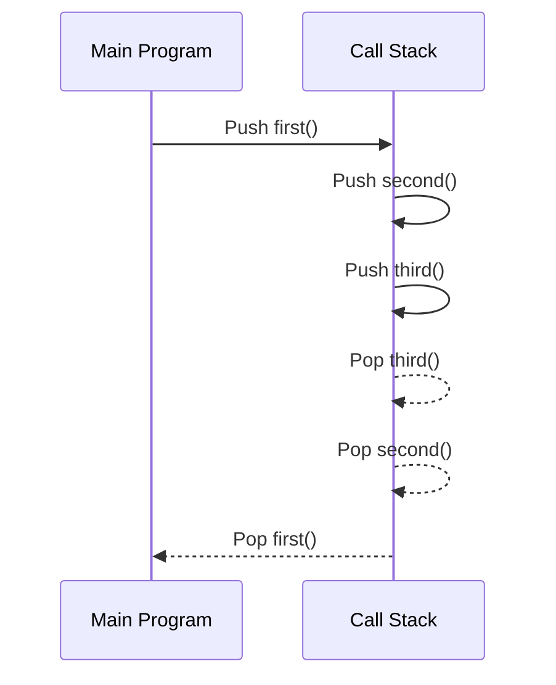
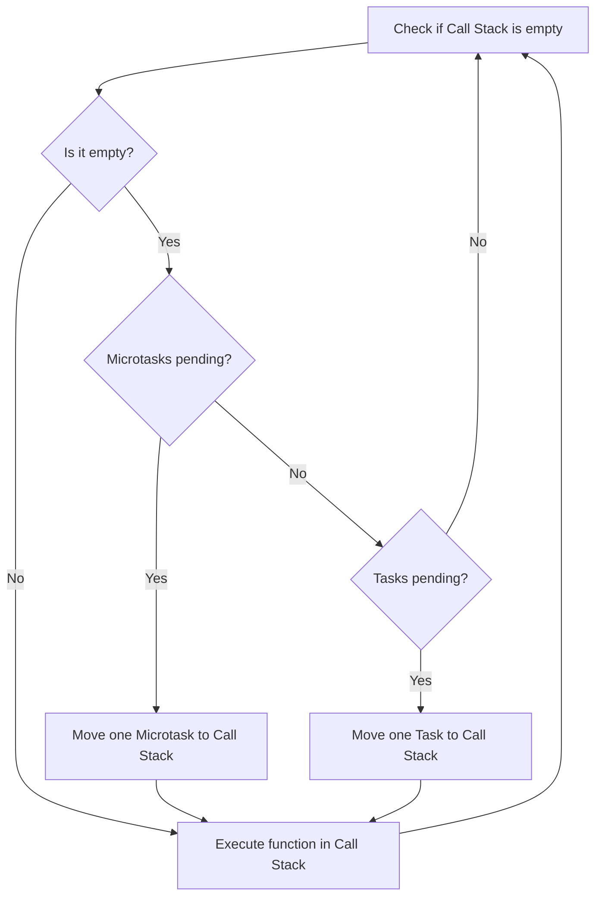
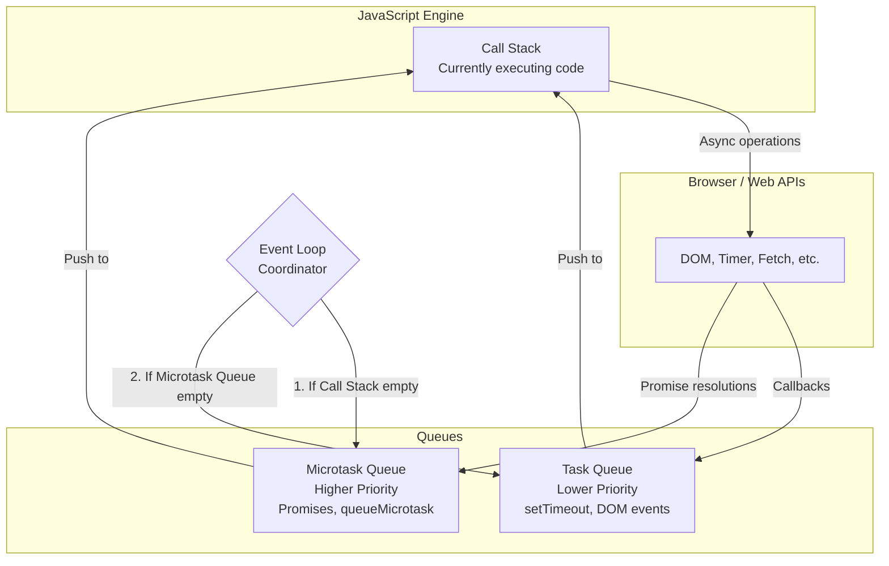

# JavaScript Event Loop - Deep Dive Explanation

## Table of Contents
1. [What is the Event Loop?](#what-is-the-event-loop)
2. [Components of the Event Loop](#components-of-the-event-loop)
3. [How the Event Loop Works](#how-the-event-loop-works)
4. [Task Queues and Priorities](#task-queues-and-priorities)
5. [Step-by-Step Examples](#step-by-step-examples)
6. [Common Misconceptions](#common-misconceptions)
7. [Advanced Concepts](#advanced-concepts)
8. [Interview Questions](#interview-questions)

---

## What is the Event Loop?

The **Event Loop** is the mechanism that allows JavaScript to perform non-blocking operations despite being single-threaded. It's responsible for:

- Managing the execution of code
- Handling asynchronous operations
- Coordinating between different queues
- Ensuring the UI remains responsive

### Why is it Important?

JavaScript runs on a **single thread**, meaning it can only execute one piece of code at a time. Without the Event Loop, any long-running operation would freeze the entire application. The Event Loop enables JavaScript to:

1. Execute code without blocking
2. Handle multiple asynchronous operations
3. Maintain responsiveness in web applications
4. Process user interactions while other operations are running

---

## Components of the Event Loop

### 1. Call Stack
- **What it is**: A LIFO (Last In, First Out) stack that tracks function calls
- **Purpose**: Keeps track of what function is currently running
- **Behavior**: Functions are pushed when called, popped when they return



```javascript
function first() {
    console.log('First function');
    second();
}

function second() {
    console.log('Second function');
    third();
}

function third() {
    console.log('Third function');
}

first();

// Call Stack execution:
// 1. first() pushed
// 2. second() pushed (on top of first)
// 3. third() pushed (on top of second)
// 4. third() completes, popped
// 5. second() completes, popped
// 6. first() completes, popped
```

### 2. Web APIs (Browser Environment)
- **What it is**: Browser-provided APIs that handle asynchronous operations
- **Examples**: `setTimeout`, `setInterval`, DOM events, HTTP requests, `fetch`
- **Purpose**: Offload time-consuming operations from the main thread

```javascript
// These operations are handled by Web APIs:
setTimeout(() => {}, 1000);        // Timer API
fetch('/api/data');                // Network API
document.addEventListener('click'); // DOM API
```

### 3. Task Queue (Callback Queue/Macrotask Queue)
- **What it is**: A FIFO (First In, First Out) queue for callback functions
- **Contains**: Callbacks from `setTimeout`, `setInterval`, DOM events
- **Priority**: Lower than Microtask Queue

### 4. Microtask Queue
- **What it is**: A higher-priority queue for specific asynchronous operations
- **Contains**: Promise callbacks (`.then`, `.catch`, `.finally`), `queueMicrotask`, `MutationObserver`
- **Priority**: Higher than Task Queue

### 5. Event Loop
- **What it is**: The coordinator that moves tasks between queues and the Call Stack
- **Job**: Continuously checks if the Call Stack is empty and moves tasks accordingly

---

## How the Event Loop Works

### The Event Loop Algorithm:



```text
1. Check if Call Stack is empty
2. If Call Stack is empty:
   a. Check Microtask Queue
   b. If Microtask Queue has tasks, move one to Call Stack
   c. If Microtask Queue is empty, check Task Queue
   d. If Task Queue has tasks, move one to Call Stack
3. Execute the function in Call Stack
4. Repeat from step 1
```

### Key Rules:
1. **Call Stack must be empty** before Event Loop processes queues
2. **Microtasks have priority** over regular tasks
3. **All microtasks are processed** before any task from Task Queue
4. **Rendering happens** between task queue processing (in browsers)

---

## Task Queues and Priorities

### Priority Order (Highest to Lowest):
1. **Call Stack** (currently executing code)
2. **Microtask Queue** (Promises, queueMicrotask)
3. **Task Queue** (setTimeout, setInterval, DOM events)

### Microtask Queue Examples:
```javascript
// These go to Microtask Queue:
Promise.resolve().then(() => console.log('Promise'));
queueMicrotask(() => console.log('Microtask'));

// Promise callbacks
fetch('/api').then(response => console.log('Fetch response'));
```

### Task Queue Examples:
```javascript
// These go to Task Queue:
setTimeout(() => console.log('Timeout'), 0);
setInterval(() => console.log('Interval'), 1000);

// DOM events
button.addEventListener('click', () => console.log('Click'));
```

---

## Step-by-Step Examples

### Example 1: Basic Event Loop Flow

```javascript
console.log('1');

setTimeout(() => console.log('2'), 0);

Promise.resolve().then(() => console.log('3'));

console.log('4');

// Output: 1, 4, 3, 2
```

**Step-by-Step Execution:**

1. **Call Stack**: `console.log('1')` → Output: "1"
2. **Call Stack**: `setTimeout(...)` → Timer registered in Web APIs
3. **Call Stack**: `Promise.resolve().then(...)` → Promise added to Microtask Queue
4. **Call Stack**: `console.log('4')` → Output: "4"
5. **Call Stack is empty** → Event Loop checks queues
6. **Microtask Queue**: `console.log('3')` → Output: "3"
7. **Task Queue**: `console.log('2')` → Output: "2"

### Example 2: Multiple Microtasks vs Tasks

```javascript
console.log('Start');

setTimeout(() => console.log('Timeout 1'), 0);
setTimeout(() => console.log('Timeout 2'), 0);

Promise.resolve().then(() => {
    console.log('Promise 1');
    return Promise.resolve();
}).then(() => console.log('Promise 2'));

Promise.resolve().then(() => console.log('Promise 3'));

console.log('End');

// Output: Start, End, Promise 1, Promise 3, Promise 2, Timeout 1, Timeout 2
```

**Explanation:**
1. Synchronous code runs first: "Start", "End"
2. All microtasks (Promises) are processed: "Promise 1", "Promise 3", "Promise 2"
3. Then tasks (setTimeout): "Timeout 1", "Timeout 2"

### Example 3: Nested Timers and Promises

```javascript
console.log('1');

setTimeout(() => {
    console.log('2');
    Promise.resolve().then(() => console.log('3'));
    setTimeout(() => console.log('4'), 0);
}, 0);

Promise.resolve().then(() => {
    console.log('5');
    setTimeout(() => console.log('6'), 0);
});

console.log('7');

// Output: 1, 7, 5, 2, 3, 6, 4
```

**Detailed Execution:**

1. **Sync**: "1", "7"
2. **Microtask**: "5" (also queues setTimeout for "6")
3. **Task**: "2" (also queues Promise for "3" and setTimeout for "4")
4. **Microtask**: "3" (from Promise created in step 3)
5. **Task**: "6" (from setTimeout created in step 2)
6. **Task**: "4" (from setTimeout created in step 3)

### Example 4: Event Loop with async/await

```javascript
console.log('1');

async function asyncFunction() {
    console.log('2');
    await Promise.resolve();
    console.log('3');
    await Promise.resolve();
    console.log('4');
}

asyncFunction();

Promise.resolve().then(() => console.log('5'));

console.log('6');

// Output: 1, 2, 6, 3, 5, 4
```

**Explanation:**
- `async/await` creates microtasks for each `await`
- Each `await` splits the function execution
- Other microtasks can run between awaited operations

---

## Common Misconceptions

### Misconception 1: "setTimeout(fn, 0) runs immediately"

**Reality**: It's queued in Task Queue and runs after all microtasks

```javascript
console.log('1');
setTimeout(() => console.log('2'), 0);
Promise.resolve().then(() => console.log('3'));
console.log('4');

// Output: 1, 4, 3, 2 (NOT 1, 2, 3, 4)
```

### Misconception 2: "Promises always run before setTimeout"

**Reality**: Only Promise callbacks (microtasks) have priority, not Promise creation

```javascript
console.log('1');

new Promise(resolve => {
    console.log('2'); // This runs immediately (synchronous)
    resolve();
}).then(() => console.log('3')); // This is a microtask

setTimeout(() => console.log('4'), 0);

console.log('5');

// Output: 1, 2, 5, 3, 4
```

### Misconception 3: "Event Loop processes all tasks at once"

**Reality**: Event Loop processes tasks one by one, but ALL microtasks before ANY task

```javascript
setTimeout(() => console.log('Task 1'), 0);
setTimeout(() => console.log('Task 2'), 0);

Promise.resolve().then(() => console.log('Microtask 1'));
Promise.resolve().then(() => console.log('Microtask 2'));

// Output: Microtask 1, Microtask 2, Task 1, Task 2
```

---

## Advanced Concepts

### 1. Microtask Queue Starvation

If microtasks keep creating more microtasks, tasks will never run:

```javascript
function recursiveMicrotask() {
    Promise.resolve().then(() => {
        console.log('Microtask');
        recursiveMicrotask(); // Creates another microtask
    });
}

setTimeout(() => console.log('This will never run'), 0);
recursiveMicrotask();

// This creates an infinite loop of microtasks!
// The setTimeout will never execute
```

### 2. Render Blocking

The browser can only render between tasks, not during microtask processing:

```javascript
// This will block rendering until all microtasks complete
function createManyMicrotasks() {
    for (let i = 0; i < 100000; i++) {
        Promise.resolve().then(() => {
            // Some work that blocks rendering
        });
    }
}
```

### 3. queueMicrotask API

Direct way to add microtasks:

```javascript
console.log('1');

queueMicrotask(() => console.log('2'));

Promise.resolve().then(() => console.log('3'));

console.log('4');

// Output: 1, 4, 2, 3 (or 1, 4, 3, 2 - order of microtasks may vary)
```

### 4. Node.js Event Loop Differences

Node.js has additional phases and queues:

```javascript
// Node.js specific queues:
setImmediate(() => console.log('setImmediate'));
process.nextTick(() => console.log('nextTick'));

// process.nextTick has higher priority than Promise microtasks in Node.js
```

---

## Visual Representation



---

## Interview Questions

### Q1: What will this code output?

```javascript
console.log('A');

setTimeout(() => console.log('B'), 0);

Promise.resolve().then(() => {
    console.log('C');
    setTimeout(() => console.log('D'), 0);
});

console.log('E');
```

**Answer**: A, E, C, B, D

### Q2: Explain why setTimeout(fn, 0) doesn't run immediately

**Answer**: Because it goes to the Task Queue, which is only processed after the Call Stack is empty and all microtasks are processed.

### Q3: How would you ensure a function runs after all current microtasks?

```javascript
function runAfterMicrotasks(callback) {
    setTimeout(callback, 0);
}

// Or in modern environments:
function runAfterMicrotasks(callback) {
    scheduler.postTask(callback, { priority: 'user-blocking' });
}
```

### Q4: What's the difference between these two?

```javascript
// Version 1
Promise.resolve().then(() => console.log('1'));
Promise.resolve().then(() => console.log('2'));

// Version 2
Promise.resolve()
    .then(() => console.log('1'))
    .then(() => console.log('2'));
```

**Answer**: 
- Version 1: Both callbacks are added to microtask queue immediately → Output: 1, 2
- Version 2: Second `.then` is only added after first completes → Output: 1, 2 (but second "2" runs in next microtask cycle)

---

## Key Takeaways

1. **JavaScript is single-threaded** but can handle async operations via Event Loop
2. **Microtasks always have priority** over regular tasks
3. **All microtasks must complete** before any task runs
4. **Understanding execution order** is crucial for debugging async code
5. **Event Loop enables non-blocking behavior** in JavaScript
6. **Call Stack must be empty** for Event Loop to process queues
7. **Web APIs handle async operations** outside the main thread

Understanding the Event Loop is essential for:
- Writing efficient asynchronous code
- Debugging timing issues
- Optimizing application performance
- Avoiding common async pitfalls
- Succeeding in JavaScript interviews

---

## Practice Exercise

Try to predict the output of this complex example:

```javascript
console.log('1');

setTimeout(() => {
    console.log('2');
    Promise.resolve().then(() => console.log('3'));
}, 0);

new Promise((resolve) => {
    console.log('4');
    resolve();
}).then(() => {
    console.log('5');
    setTimeout(() => console.log('6'), 0);
});

setTimeout(() => console.log('7'), 0);

Promise.resolve().then(() => {
    console.log('8');
    Promise.resolve().then(() => console.log('9'));
});

console.log('10');
```

**Try to solve it yourself before looking at the answer!**

**Answer**: 1, 4, 10, 5, 8, 9, 2, 3, 7, 6 