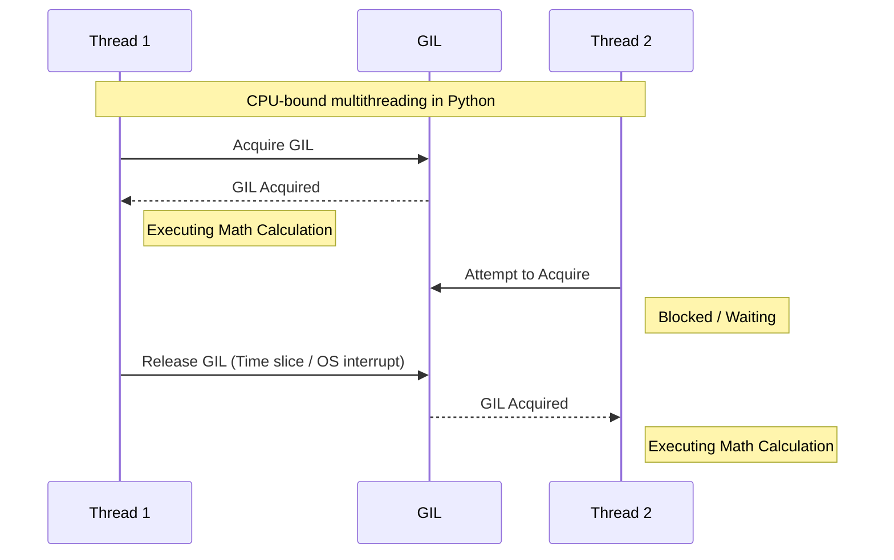

# Senior Python Framework Architect Interview Guide - Comprehensive Edition

This guide covers advanced Python internals, framework building, library design, packaging, system design, and coding exercises. It has been expanded to include detailed explanations and code examples for all major concepts.

---

## 1. Python Internals

### Q: What happens when you import a module?
**Answer:** When `import foo` is called, a complex sequence of events occurs:
1. Python checks `sys.modules` (a dictionary caching all previously imported modules). If `foo` is there, it simply returns the cached object to save time.
2. If not found, Python searches the directory paths listed in `sys.path`.
3. Once the file `foo.py` is found, Python compiles it into bytecode (`foo.pyc`) to speed up future imports (unless the `.pyc` is already up to date).
4. It creates a new empty module object in memory.
5. It executes the code inside `foo.py` from top to bottom. Any variables, functions, or classes defined are added to the module object's namespace.
6. The module object is stored in `sys.modules['foo']` and made available to your code.

### Q: Difference between module, package, library, framework
**Answer:**
These terms represent a hierarchy of scale and a shift in control.

1.  **Module**: The smallest unit. It is simply a single `.py` file containing Python code (variables, functions, classes). 
    *   *Example:* `math.py`, `utils.py`.
2.  **Package**: A collection of modules. It is a directory containing multiple `.py` files, usually with a special `__init__.py` file to tell Python this folder is a package.
    *   *Example:* A folder named `user_auth/` containing `login.py`, `logout.py`, and `__init__.py`.
3.  **Library**: A collection of related packages and modules bundled together to solve a specific problem. **Crucial distinction: You call a library.** Your code is in control, and it imports the library when it needs to perform a task (like making an HTTP request).
    *   *Example:* `requests`, `pandas`, `numpy`.
4.  **Framework**: A large architectural skeleton that dictates how your application should be structured. **Crucial distinction: A framework calls *your* code.** This is known as **Inversion of Control (IoC)**. You write functions and register them with the framework, and the framework's internal engine decides when and how to execute your functions (e.g., when an HTTP request arrives).
    *   *Example:* `FastAPI`, `Django`, `React`.

**Analogy:**
*   **Module**: A single brick.
*   **Package**: A wall made of bricks.
*   **Library**: A toolbox. You take out a hammer (function) whenever *you* decide you need to hit a nail.
*   **Framework**: The blueprint and foundation of a house. It defines where the walls go. You just paint the walls and fill the rooms (write the business logic), but the house structure is already built and dictates the layout.

### Q: How does Python memory management work?
**Answer:** Python abstracts memory management using a private heap. 
1.  **Reference Counting**: Every object keeps track of how many variables point to it. 
    ```python
    a = [1, 2, 3] # Reference count is 1
    b = a         # Reference count is 2
    del a         # Reference count drops to 1
    b = None      # Reference count drops to 0. Memory is instantly freed!
    ```
2.  **Generational Garbage Collector (GC)**: Reference counting fails with "cyclic references" (e.g., an object that refers to itself, or A refers to B, and B refers to A). The GC periodically scans memory for these cycles and deletes them. It categorizes objects into 3 "generations" (young, middle-aged, old) to optimize scanning speed.

### Q: What is GIL? When is it a problem?
**Answer:** The Global Interpreter Lock (GIL) is a mutex (a lock) that allows only one thread to execute Python bytecode at a time, even on multi-core processors. 


**Problem:** If you have heavy math (CPU-bound) running in two threads, they will just take turns, meaning 2 threads take the same time (or longer) than 1 thread.
**Solution:** Use `multiprocessing` (which creates entirely separate Python processes, each with their own GIL) or use `asyncio` for I/O bound tasks.

### Q: Difference between multiprocessing, multithreading, asyncio
**Answer:**
*   **Multiprocessing**: Spawns entirely new OS processes. Bypasses the GIL. Best for heavy CPU work (e.g., image processing, machine learning). High memory usage.
*   **Multithreading**: Uses OS threads within the *same* process. Blocked by the GIL for CPU tasks. Best for blocking I/O (e.g., downloading 10 images concurrently using legacy `requests`).
*   **Asyncio**: Uses a single thread and an Event Loop. When a coroutine asks for a network request, the event loop pauses it and works on another coroutine until the network responds. Best for massive concurrency (thousands of WebSocket connections).

### Q: Explain `__init__.py`
**Answer:** It tells Python that a directory is a package. It is heavily used in library development to simplify imports for the end user.

**Example:**
```python
# Inside my_library/models/user.py
class User: pass

# Inside my_library/models/__init__.py
from .user import User
__all__ = ["User"]

# Now the developer using your library can type:
from my_library.models import User 
# Instead of the ugly: from my_library.models.user import User
```

### Q: What are decorators and how are they implemented?
**Answer:** A decorator is a function that takes another function, adds some functionality, and returns a new function.

**Simple Example:**
```python
def make_polite(func):
    def wrapper():
        print("Hello! Starting...")
        func() # Call the original function
        print("Goodbye! Finished.")
    return wrapper

@make_polite
def say_name():
    print("My name is Alice.")

say_name() 
# Output:
# Hello! Starting...
# My name is Alice.
# Goodbye! Finished.
```
*(Note: In production frameworks, decorators use `*args, **kwargs` so they can wrap functions that take arguments, and they use `@functools.wraps` to keep the original function's name intact).*

### Q: What are metaclasses?
**Answer:** A metaclass intercepts the creation of a class itself. Just as a class dictates how instances behave, a metaclass dictates how classes behave.

**Example (Singleton Metaclass):**
```python
class SingletonMeta(type):
    _instances = {}
    
    def __call__(cls, *args, **kwargs):
        if cls not in cls._instances:
            # If the class hasn't been created yet, create it and save it
            cls._instances[cls] = super().__call__(*args, **kwargs)
        # Always return the exact same saved instance
        return cls._instances[cls]

class Database(metaclass=SingletonMeta):
    pass
    
db1 = Database()
db2 = Database()
print(db1 is db2) # True. They are the exact same object in memory!
```

### Q: How does Method Resolution Order (MRO) work?
**Answer:** MRO dictates the order in which Python searches for base classes during multiple inheritance. Python uses the C3 Linearization algorithm.

**Example:**
```python
class A: pass
class B(A): pass
class C(A): pass
class D(B, C): pass

print(D.mro()) 
# Order: D -> B -> C -> A -> object. 
# It searches left-to-right, but goes deep only when a class isn't inherited by something else later in the chain.
```

---

## 2. Framework Architecture

### Q: How do you design a framework at a high level? What are the core components?
**Answer:** Designing a framework requires planning how developers will interact with your code (Inversion of Control) and how the application will scale. A modern web framework usually consists of 5 core architectural components:
1.  **The Server Gateway Interface (ASGI/WSGI)**: The entry point that translates raw HTTP/TCP bytes into Python dictionaries/objects.
2.  **The Routing Engine**: A mechanism (often a Radix Tree or Regex list) that matches incoming URLs to the specific Python function (controller/view) the developer wrote.
3.  **The Request/Response Abstraction**: Classes that wrap raw headers and body data into user-friendly `Request` and `Response` objects (e.g., handling JSON parsing automatically).
4.  **The Middleware Pipeline**: An Onion-style layered architecture that wraps the core application, allowing cross-cutting concerns like logging, CORS, and authentication to intercept requests.
5.  **The Dependency Injection / Plugin System**: A registry that manages the lifecycle of shared resources (like Database Connections) and injects them into the developer's functions at runtime.

### Q: How would you build a Python web framework from scratch?
**Answer:** I would build an ASGI (Asynchronous Server Gateway Interface) application. 
An ASGI app is simply a callable (like a function or class) that takes three arguments: `scope` (details about the request), `receive` (an async function to get the request body), and `send` (an async function to send the response back).

**Example of a mini-framework core:**
```python
async def my_framework(scope, receive, send):
    if scope['type'] == 'http':
        path = scope['path']
        if path == "/":
            body = b"Hello from my custom framework!"
            await send({
                'type': 'http.response.start',
                'status': 200,
                'headers': [(b'content-type', b'text/plain')],
            })
            await send({
                'type': 'http.response.body',
                'body': body,
            })
```

### Q: How does dependency injection work?
**Answer:** Dependency Injection (DI) allows a function to declare what it needs (dependencies), and the framework automatically provides them at runtime.

**Example (How a framework resolves DI internally):**
```python
import inspect

# 1. The user defines a dependency
def get_database():
    return "Database Connection"

# 2. The user defines an endpoint using the dependency
def get_user(db = get_database): 
    return f"Fetching user from {db}"

# 3. The Framework's internal routing engine:
sig = inspect.signature(get_user)
kwargs_to_inject = {}

for name, param in sig.parameters.items():
    if callable(param.default):
        # The framework executes the dependency and stores the result
        kwargs_to_inject[name] = param.default() 

# The framework safely calls the endpoint with the injected data!
result = get_user(**kwargs_to_inject) 
print(result) # Prints: Fetching user from Database Connection
```

### Q: How would you implement middleware?
**Answer:** Middleware is code that runs *before* a request reaches your endpoint, and *after* the endpoint returns a response. It wraps the core application.

**Example (A custom Timing Middleware):**
```python
from fastapi import FastAPI, Request
import time

app = FastAPI()

@app.middleware("http")
async def add_process_time_header(request: Request, call_next):
    # 1. Code executed BEFORE the route is hit
    start_time = time.time()
    
    # 2. Pass control to the router/endpoint
    response = await call_next(request)
    
    # 3. Code executed AFTER the route finishes
    process_time = time.time() - start_time
    response.headers["X-Process-Time"] = str(process_time)
    
    return response
```

### Q: How would you design a plugin architecture?
**Answer:** Using an Event Hook system. The core framework shouldn't know about plugins. Instead, it emits events, and plugins listen to those events.

**Example:**
```python
class Framework:
    def __init__(self):
        self.hooks = {"before_start": []}
        
    def register_plugin(self, hook_name, callback):
        self.hooks[hook_name].append(callback)
        
    def start(self):
        # Trigger all registered plugins
        for callback in self.hooks["before_start"]:
            callback()
        print("Framework started!")

# A developer creates a plugin:
def my_custom_logger():
    print("Plugin: Setting up logging...")

app = Framework()
app.register_plugin("before_start", my_custom_logger)
app.start() 
# Output:
# Plugin: Setting up logging...
# Framework started!
```

---

## 3. Library Development

### Q: Difference between framework and library
**Answer:** Inversion of Control. 
*   You import a library (like `math` or `requests`) and *you* decide exactly when to call its functions. 
*   With a framework (like `FastAPI`), you write a function, hand it to the framework (`@app.get()`), and the *framework* decides when to call it based on incoming HTTP traffic.

### Q: How do you avoid breaking changes?
**Answer:** When you update your library, you don't want to break the code of developers relying on it.
1.  **Use `**kwargs`**: Always allow extra arguments in core functions so you can add new features later without breaking function signatures.
2.  **Deprecation Cycle**: If you must remove a feature, use the `warnings` module for an entire version cycle before deleting the code.

**Example:**
```python
import warnings

def old_function():
    warnings.warn(
        "old_function is deprecated and will be removed in v2.0. Use new_function instead.",
        DeprecationWarning,
        stacklevel=2
    )
    return "old result"
```

---

## 4. Packaging & Distribution

### Q: Difference between setup.py and pyproject.toml
**Answer:**
*   `setup.py`: The old way. It is an executable Python script. This is dangerous because installing a package means running arbitrary code on the user's machine.
*   `pyproject.toml`: The modern standard (PEP 518). It is a static configuration file (like `package.json` in Node.js). It simply declares metadata and dependencies, making package management much safer and faster.

### Q: What is wheel vs source distribution?
**Answer:**
*   **sdist (.tar.gz)**: The raw source code. If the library includes C or C++ code, the user's computer must have a compiler to build it during `pip install`.
*   **wheel (.whl)**: A pre-compiled binary package. It installs instantly just by unzipping files. You should always upload wheels to PyPI so users don't need compilers.

---

## 5. Testing

### Q: Mocking external dependencies
**Answer:** Unit tests should not hit real databases or external APIs (like Stripe or AWS). You use `unittest.mock` to fake those connections.

**Example:**
```python
from unittest.mock import patch
import my_module

# We temporarily replace the real 'requests.get' with a fake mock object
@patch('my_module.requests.get')
def test_fetch_data(mock_get):
    # Configure the fake response
    mock_get.return_value.status_code = 200
    mock_get.return_value.json.return_value = {"status": "success"}
    
    # Call the function being tested
    result = my_module.fetch_external_data()
    
    assert result == {"status": "success"}
    mock_get.assert_called_once_with("https://api.example.com/data")
```

### Q: Pytest fixtures
**Answer:** Fixtures provide a clean way to setup and teardown test data without duplicating code across hundreds of tests.

**Example:**
```python
import pytest

@pytest.fixture
def fake_database():
    print("\n[Setup] Connecting to test DB...")
    db = {"user": "Alice"}
    yield db # Pauses here and gives 'db' to the test
    print("\n[Teardown] Dropping test DB...")

def test_user_exists(fake_database):
    # 'fake_database' automatically receives the dictionary from the fixture
    assert fake_database["user"] == "Alice"
```

### Q: What is `conftest.py` in Pytest?
**Answer:** It is a special configuration file for Pytest. Any fixtures defined inside `conftest.py` are automatically available to all test files in the same directory (and its subdirectories) without needing to explicitly import them. It's the standard way to share database connections, API clients, or test data across your entire test suite.

### Q: How do you run the same test with multiple different inputs?
**Answer:** Using `@pytest.mark.parametrize`. It allows you to define multiple sets of arguments and expected results for a single test function, and Pytest will run the test independently for each set.

**Example:**
```python
import pytest

# This will run the test 3 times with different inputs
@pytest.mark.parametrize("input_val, expected", [
    (2, 4),
    (3, 9),
    (4, 16)
])
def test_square(input_val, expected):
    assert input_val * input_val == expected
```

### Q: Pytest vs `unittest` (Standard Library)
**Answer:**
*   **Boilerplate**: `unittest` requires writing tests as classes that inherit from `unittest.TestCase`, whereas Pytest allows you to write simple, plain functions.
*   **Assertions**: `unittest` uses verbose methods like `self.assertEqual(a, b)` or `self.assertTrue(x)`. Pytest uses standard Python `assert a == b`, and it uses introspection to give incredibly detailed error messages if the assert fails.
*   **Setup/Teardown**: `unittest` uses `setUp()` and `tearDown()` methods. Pytest uses the much more flexible and composable `fixtures` system.

---

## 6. Performance

### Q: Caching strategies
**Answer:** Caching stores the result of expensive function calls.
*   **LRU Cache (In-Memory)**: Built into Python via `functools.lru_cache`. Extremely fast, but the cache is destroyed when the server restarts.

**Example:**
```python
from functools import lru_cache

@lru_cache(maxsize=128)
def expensive_db_query(user_id):
    # Imagine this takes 5 seconds
    return f"Data for {user_id}"

print(expensive_db_query(1)) # Takes 5 seconds
print(expensive_db_query(1)) # Returns instantly!
```

---

## 7. FastAPI, Starlette, ASGI & Pydantic Internals

### Q: How Starlette and Pydantic work underneath FastAPI
**Answer:** FastAPI is essentially a glue layer between two powerful tools:
1.  **Starlette**: A blazing-fast ASGI microframework. It handles all the networking: receiving HTTP requests, managing routing (URLs), and sending HTTP responses.
2.  **Pydantic**: A data validation library. It uses Python type hints (`int`, `str`) to automatically validate incoming JSON data.

**How they interact in FastAPI:**
When a request hits `POST /users`, Starlette receives the raw JSON string. FastAPI intercepts it, hands the JSON to a Pydantic `User` model for validation. If valid, FastAPI hands the clean Python object to your endpoint function. Finally, FastAPI takes your function's return value, gives it back to Pydantic to convert into a JSON string, and hands it to Starlette to send back to the user.

---

## 8. Advanced / Expert Python Questions

### Q: Context Variables (`contextvars`) vs `threading.local()`
**Answer:** In synchronous web frameworks (like Django/Flask), you use `threading.local()` to store data specific to the current HTTP request (like the current user) so you don't have to pass `request` into every single function. 
However, in asynchronous frameworks (like FastAPI), multiple requests run concurrently on the *same* thread (via the event loop). If you use `threading.local()`, requests will overwrite each other's data!
**Solution:** Python 3.7 introduced `contextvars`. They are async-safe variables that natively integrate with the `asyncio` event loop.

**Example:**
```python
import contextvars
import asyncio

# Create a Context Variable
request_id = contextvars.ContextVar("request_id")

async def inner_function():
    # Safely retrieve the value for THIS specific coroutine/request
    print(f"Processing: {request_id.get()}")

async def handle_request(req_id):
    request_id.set(req_id)
    await inner_function()

# Even though they run concurrently on the same thread, the contexts don't mix!
asyncio.run(asyncio.gather(
    handle_request("Request-1"),
    handle_request("Request-2")
))
```

### Q: What is the Application Factory Pattern?
**Answer:** Instead of creating a global `app` instance at the top level of your module (`app = FastAPI()`), you put the creation inside a function `def create_app(): ...`.
**Why?** 
1. **Testing**: You can easily spin up multiple fresh instances of your app for different test cases without them sharing state.
2. **Multiple Configurations**: You can run `create_app(env="production")` vs `create_app(env="testing")`.

### Q: What is the difference between `__getattr__` and `__getattribute__`?
**Answer:** Both are "magic methods" for accessing attributes on an object.
*   `__getattribute__`: Called **every single time** you try to access an attribute (`obj.x`), regardless of whether the attribute exists. It is very dangerous to override because it easily causes infinite recursion.
*   `__getattr__`: Called **only as a fallback** if the attribute is NOT found by normal means. It is incredibly useful in frameworks for building dynamic APIs, lazy-loading objects, or "dot notation" dictionary wrappers.

### Q: How do you handle Background Tasks in a web framework?
**Answer:** If an endpoint needs to send an email, doing it synchronously blocks the response from returning to the user.
*   **Simple approach**: Use `BackgroundTasks` (FastAPI) which simply spawns a thread/coroutine to run the task *after* the HTTP response is sent. However, if the server crashes, the task is lost.
*   **Architectural approach**: Use a message broker (RabbitMQ, Redis) and a distributed task queue (Celery, RQ). The endpoint pushes a message to Redis and returns immediately. A separate worker process pulls the message and sends the email. This guarantees reliability and offloads CPU/network work from the web server.

### Q: What are Weak References (`weakref`)?
**Answer:** Normally, an object stays in memory as long as there is at least one reference to it. A weak reference is a reference that *does not* increase the reference count. If the only references left to an object are weak references, the Garbage Collector will delete it. 
Frameworks use `weakref` heavily for caching (so the cache doesn't prevent objects from being deleted) or to avoid memory leaks in large object graphs (like ORM relationships).
